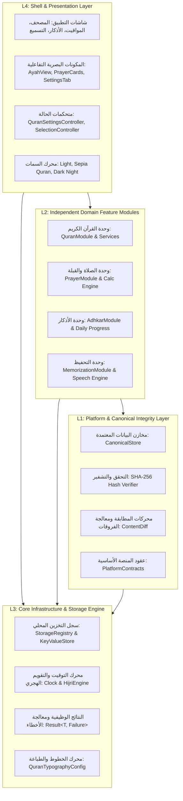
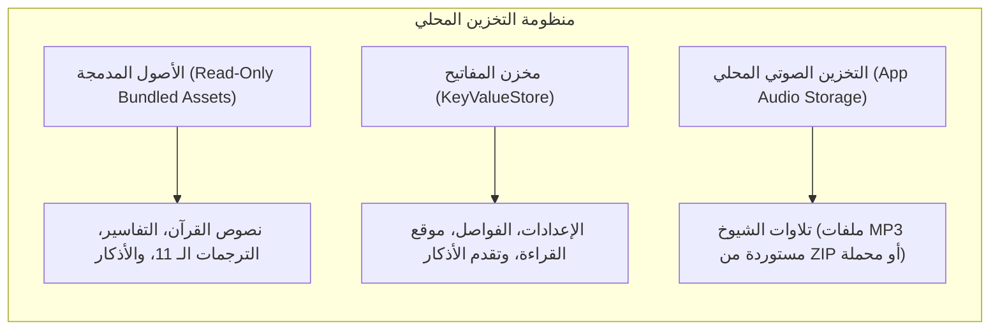

# 00 — المعمارية العامة للنظام (System Architecture Specification)

يتبنى مشروع **سِراج (SIRAJ v1.0)** معمارية هندسية معيارية رباعية الطبقات (4-Tier Clean Layered Architecture) مصممة خصيصاً للأنظمة الإسلامية الحساسة التي تتطلب **أعلى درجات الموثوقية والنزاهة الشرعية** و**العمل التام بدون اتصال بالإنترنت (100% Offline-First)**.

---

## 🏛️ 1. النموذج الطبقي المعماري (The 4-Tier Layering Model)

تم تصميم النظام ليعمل باتجاه اعتمادية أحادي صارم (Strict Unidirectional Dependency)؛ حيث لا يُسمح لأي طبقة دنيا بمعرفة أو استدعاء أي طبقة تعلوها، مما يضمن قابلية الاختبار بنسبة 100%، وسهولة التوسع والصيانة.

---

## 📦 2. تفصيل الطبقات المعمارية ومسؤولياتها

### الطبقة الأولى: المنصة والمخازن المعتمدة (L1: Platform & Canonical Storage)
- **المسار المصدري**: `lib/platform/`
- **الهدف**: حماية وتوفير البيانات الشرعية غير القابلة للتعديل والتحقق من صحتها.
- **المكونات الأساسية**:
  - `CanonicalQuranLoader`: محمل البيانات الموثق لقراءة نصوص السور، الآيات، التجويد، والتفاسير الميسرة من حزم الأصول المشفرة.
  - `ContentRecord` & `CanonicalSourceRef`: البنية المعيارية لتوثيق المصادر الشرعية (رقم الطبعة، جهة الاعتماد، تاريخ التوثيق، والبصمة الرقمية).
  - `HashVerifier`: فحص تجزئة SHA-256 للبيانات المجمعة لضمان عدم حدوث أي تلاعب أو تلف في البيانات أثناء التحديثات.
  - **مبدأ الإغلاق عند الفشل (Fail-Closed Integrity)**: إذا حدث أي تعارض في البصمة الرقمية للآيات أو الأحاديث، يرفض النظام عرض المحتوى المشكوك فيه فوراً.

### الطبقة الثانية: الوحدات الوظيفية المستقلة (L2: Domain Modules)
- **المسار المصدري**: `lib/modules/`
- **الهدف**: تجسيد منطق الأعمال الشرعي والتفاعلي لكل ركن من أركان التطبيق.
- **الوحدات الرئيسية**:
  1. **وحدة القرآن الكريم (`lib/modules/quran/`)**:
     - `QuranModule`: نقطة الدخول الموحدة للوحدة.
     - `QuranAudioService`: إدارة تلاوات القراء، البث، وتحديد مصادر الصوت.
     - `QuranOfflineAudioService`: محرك فك حزم الـ ZIP بالتدفق المباشر وتحميل السور بدون إنترنت.
     - `TajweedRenderer`: تحليل وتطبيق أحكام التجويد الـ 13 على النص العثماني.
     - `TafsirService`: استرجاع التفاسير الميسرة ومعاني الكلمات.
  2. **وحدة الصلاة والقبلة (`lib/modules/prayer/`)**:
     - `PrayerCalculationEngine`: حساب المواقيت الفلكية وفق الهيئات الـ 5 المعتمدة وتعديلات خطوط العرض العليا.
     - `QiblaService`: الحساب المثلثي الكروي لزاوية القبلة وتنعيم بيانات البوصلة والجيروسكوب.
     - `LocationArbitrationService`: التحكيم بين إحداثيات GPS وقاعدة البيانات المحلية لمدن العالم.
  3. **وحدة الأذكار والتزكية (`lib/modules/adhkar/`)**:
     - `AdhkarRepository`: إدارة نصوص حصن المسلم الموثقة، التصنيفات، والتخريج الحديثي.
     - `AdhkarProgressTracker`: متابعة الورد اليومي ومزامنة العدادات الذكية والتغذية اللمسية.
  4. **وحدة التحفيظ والتسميع (`lib/modules/memorization/`)**:
     - `SpacedRepetitionScheduler`: جدولة مراجعات الحفظ بالاعتماد على منحنى النسيان لإبنجهاوس.
     - `QuranRecitationGateway`: واجهة التسميع الصوتي المباشر والتعرف على الكلمات وتحديد الأخطاء.

### الطبقة الثالثة: البنية التحتية والخدمات المشتركة (L3: Core Infrastructure)
- **المسار المصدري**: `lib/core/`
- **الهدف**: تقديم خدمات التخزين، التوقيت، وأنماط التصميم المشتركة لكافة الوحدات.
- **المكونات الأساسية**:
  - `StorageRegistry`: السجل المركزي لإدارة مخازن البيانات محلياً.
  - `KeyValueStore` & `MemoryStorage`: عقود التخزين السريع للبيانات الوصفية والإعدادات بدون الاعتماد على مكتبات خارجية محددة.
  - `Result<T, Failure>`: نمط البرمجة الوظيفية لإرجاع النتائج ومعالجة الأخطاء بأمان ومنع الانهيارات المفاجئة (Zero Unhandled Exceptions).
  - `AppClock`: تجريد الساعة والنظام الزمني لاختبار الأوقات ومحاكاة تغير الأيام والفصول والأشهر الهجرية.

### الطبقة الرابعة: الواجهات والعرض والتفاعل (L4: Shell & Presentation)
- **المسار المصدري**: `lib/shell/`
- **الهدف**: بناء واجهات المستخدم التفاعلية والسمات البصرية وفق أعلى معايير الجمال والسهولة.
- **المكونات الأساسية**:
  - `SurahListScreen` & `QuranReaderScreen`: شاشات استعراض وقراءة المصحف الشريف والبحث.
  - `QuranSettingsTab`: التبويبة الشاملة لإدارة الخط، الحجم، القراء، التلاوة المحلية، والفواصل المرجعية.
  - `AyahView`: المكون التفاعلي للآية الواحدة المدمج مع علامات الآيات والترجمة والتفسير.
  - `AppTheme`: نظام السمات البصرية الثلاث (فاتح عاجي، ورق مصحف سيبيا، وداكن ليلي).

---

## 💾 3. معمارية التخزين وإدارة البيانات المحلية (Storage Subsystem)

يعتمد التطبيق على معمارية تخزين هجينة محكمة:

### استراتيجيات إدارة التخزين:
1. **البيانات المرجعية الثابتة (Canonical Read-Only Assets)**:
   - مدمجة في مسار `assets/` داخل حزمة التطبيق لضمان توفرها فور التثبيت وبدون استهلاك أي شبكة.
2. **بيانات حالة المستخدم (User Mutable State)**:
   - تحفظ بصيغة JSON خفيفة وذرية عبر `KeyValueStore` لضمان سرعة الاسترجاع والحفظ عند كل تنقل أو تفاعل.
3. **الملفات الصوتية الضخمة (Large Audio Assets)**:
   - تخزن في مسار التطبيق المحلي `siraj_quran_audio/<reciter_id>/001001.mp3`.
   - يتم التحقق من وجود الملفات محلياً قبل أي محاولة للبث الشبكي لتوفير استهلاك البيانات.

---

## ⚡ 4. الأداء وإدارة الذاكرة الصارمة (Memory & Performance Model)

| المجال | المعيار والتنفيذ في سِراج |
| :--- | :--- |
| **استهلاك الذاكرة العشوائية (RAM)** | لا يتجاوز **60 - 90 ميجابايت** في أقصى حالات القراءة وعرض المصحف والتفسير. |
| **فك ضغط حزم ZIP الضخمة** | استخدام `InputFileStream` و `OutputFileStream` مع `file.clear()` المباشر، مما يخفض استهلاك الذاكرة من 1.5 جيجابايت إلى **أقل من 5 ميجابايت**. |
| **معدل الإطارات (Frame Rate)** | استقرار كامل عند **60 - 120 إطار في الثانية (FPS)** على كافة الشاشات وأثناء التمرير السريع. |
| **زمن الإقلاع والجاهزية** | زمن إقلاع بارد (Cold Start) أقل من **0.8 ثانية** مع تهيئة مسبقة وغير متزامنة للخدمات. |

---

## 🛡️ 5. بروتوكولات الأمان والخصوصية (Privacy & Security Baseline)
- **الخصوصية التامة 100% (Zero Telemetry & Zero External Tracking)**:
  - لا يحتوي التطبيق على أي أدوات تتبع (Trackers)، أو إعلانات، أو تحليلات خارجية، أو جمع لبيانات المستخدم.
- **المعالجة الصوتية والموقع محلياً**:
  - إحداثيات GPS والتسجيلات الصوتية للتسميع تتم معالجتها وحفظها داخل الذاكرة المحلية للجهاز فقط ولا تغادره أبداً.

