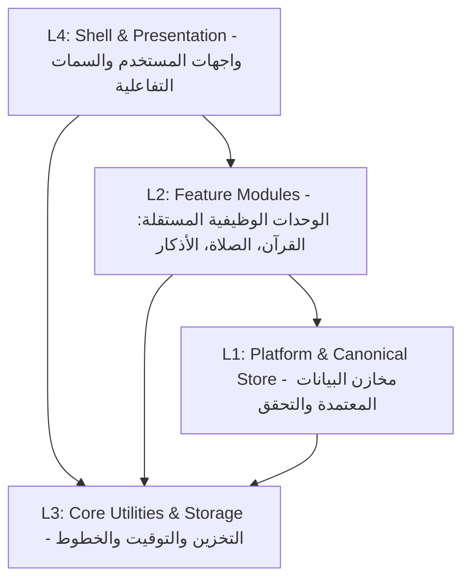

# 00 — المعمارية العامة للنظام (System Architecture)

يعتمد مشروع **سِراج (SIRAJ)** على معمارية معيارية طبقية صارمة من 4 مستويات (4-Tier Layered Architecture) تضمن الفصل التام بين منطق الأعمال، مخازن البيانات، واجهات العرض، واستقلالية المنظومة بدون إنترنت.

---

## 🏛️ طبقات النظام المعمارية (Architectural Layers)

### 1. طبقة المنصة والمخازن الأساسية (L1: Platform & Canonical Storage)
- **الموقع**: `lib/platform/`
- **المسؤولية**:
  - إدارة سجلات البيانات الشرعية المعتمدة (`ContentRecord`, `CanonicalSourceRef`).
  - التحقق من سلامة البصمة المشفرة وحماية المحتوى من التعديل أو العبث.
  - محركات مقارنة الفروقات وتحديث الحزم بطريقة ذرية وآمنة.

### 2. طبقة الوحدات الوظيفية المستقلة (L2: Domain Modules)
- **الموقع**: `lib/modules/`
- **الوحدات الرئيسية**:
  - **وحدة القرآن الكريم (`quran`)**: إدارة المصحف، التلاوة، التفسير، الترجمة، والتسميع.
  - **وحدة الصلاة والقبلة (`prayer`)**: الحساب الفلكي، تحديد الموقع، زاوية القبلة، والأذان.
  - **وحدة الأذكار والتزكية (`adhkar`)**: حصن المسلم، العدادات، والجدولة.
  - **وحدة الحفظ والمراجعة (`memorization`)**: خوارزمية التكرار المتباعد والتسميع الصوتي.
- **القاعدة الصارمة**: كل وحدة مستقلة بذاتها وتتواصل مع الوحدات الأخرى عبر عقود واضحة (`Module Contracts`).

### 3. طبقة الأساس والخدمات المشتركة (L3: Core Infrastructure)
- **الموقع**: `lib/core/`
- **المسؤولية**:
  - عقود التخزين المحلي السريع (`StorageRegistry`, `KeyValueStore`, `MemoryStorage`).
  - إدارة الوقت والتاريخ الهجري والشمسي ومحاكاة الساعات (`Clock`).
  - معالجة الأخطاء والنتائج الوظيفية (`Result<T, Failure>`).

### 4. طبقة الواجهات والعرض (L4: Shell & Presentation)
- **الموقع**: `lib/shell/`
- **المسؤولية**:
  - الشاشات الرئيسية (المصحف، المواقيت، الأذكار، الإعدادات).
  - شريط التنقل والسمات البصرية الثلاث (فاتح، ورق مصحف سيبيا، داكن).
  - التجاوب الكامل مع أحجام الشاشات المختلفة من الهواتف الصغيرة حتى الأجهزة اللوحية.

---

## 🔒 مبادئ العمل بدون إنترنت والنزاهة الشرعية (Offline-First Principles)
1. **التحميل المحلي المسبق (Pre-bundled Zero-Network Assets)**:
   - يتضمن التطبيق ملفات المصحف العثماني الكامل، الترجمات الـ 11، التفسير الميسر، والأذكار داخل حزمة الأصول أو التخزين المحلي المشفر.
2. **الإغلاق عند الفشل (Fail-Closed Integrity)**:
   - في حال تلف أي ملف بيانات، يرفض التطبيق عرض محتوى مشكوك في صحته ويعود فوراً للنسخة المعتمدة والمثبتة.
3. **التدفق المباشر للملفات الصوتية الضخمة (Streaming I/O)**:
   - التعامل مع الملفات الكبيرة (حزم الـ ZIP للتلاوات الصوتية) يتم بتدفق من القرص للقرص لمنع استهلاك الذاكرة العشوائية.
