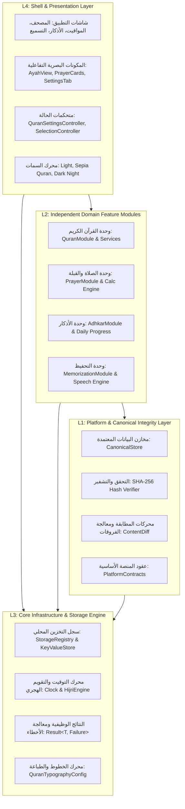
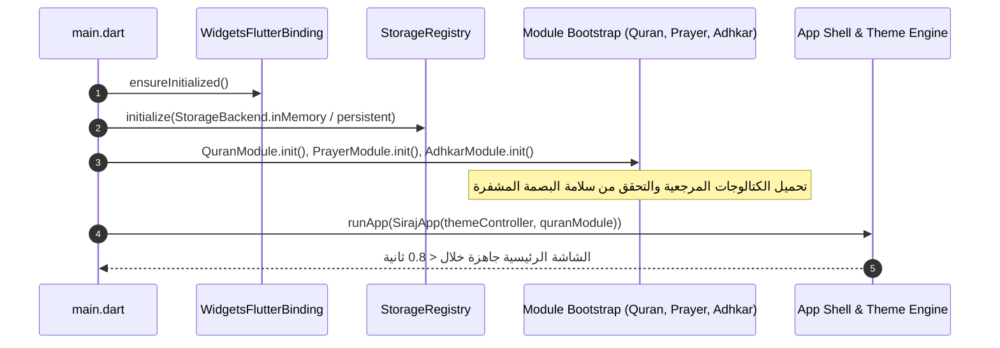

# 00 — المعمارية العامة للنظام (System Architecture Specification)

يتبنى مشروع **سِراج (SIRAJ v1.0)** معمارية هندسية معيارية رباعية الطبقات (4-Tier Clean Layered Architecture) مصممة خصيصاً للأنظمة الإسلامية الحساسة التي تتطلب **أعلى درجات الموثوقية والنزاهة الشرعية** و**العمل التام بدون اتصال بالإنترنت (100% Offline-First)**.

---

# 📑 الجزء الأول: الوصف المعماري الشامل (Architectural Overview)

## 🏛️ 1. النموذج الطبقي المعماري (The 4-Tier Layering Model)

تم تصميم النظام ليعمل باتجاه اعتمادية أحادي صارم (Strict Unidirectional Dependency)؛ حيث لا يُسمح لأي طبقة دنيا بمعرفة أو استدعاء أي طبقة تعلوها، مما يضمن قابلية الاختبار بنسبة 100%، وسهولة التوسع والصيانة.



---

## 📦 2. تفصيل الطبقات المعمارية ومسؤولياتها

### الطبقة الأولى: المنصة والمخازن المعتمدة (L1: Platform & Canonical Storage)
- **المسار المصدري**: `lib/platform/`
- **الهدف**: حماية وتوفير البيانات الشرعية غير القابلة للتعديل والتحقق من صحتها.
- **المكونات الأساسية**:
  - `CanonicalQuranLoader`: محمل البيانات الموثق لقراءة نصوص السور، الآيات، التجويد، والتفاسير الميسرة من حزم الأصول المشفرة.
  - `ContentRecord` & `CanonicalSourceRef`: البنية المعيارية لتوثيق المصادر الشرعية (رقم الطبعة، جهة الاعتماد، تاريخ التوثيق، والبصمة الرقمية).
  - `HashVerifier`: فحص تجزئة SHA-256 للبيانات المجمعة لضمان عدم حدوث أي تلاعب أو تلف في البيانات أثناء التحديثات.
  - **مبدأ الإغلاق عند الفشل (Fail-Closed Integrity)**: إذا حدث أي تعارض في البصمة الرقمية للآيات أو الأحاديث، يرفض النظام عرض المحتوى المشكوك فيه فوراً.

### الطبقة الثانية: الوحدات الوظيفية المستقلة (L2: Domain Modules)
- **المسار المصدري**: `lib/modules/`
- **الهدف**: تجسيد منطق الأعمال الشرعي والتفاعلي لكل ركن من أركان التطبيق.
- **الوحدات الرئيسية**:
  1. **وحدة القرآن الكريم (`lib/modules/quran/`)**:
     - `QuranModule`: نقطة الدخول الموحدة للوحدة.
     - `QuranAudioService`: إدارة تلاوات القراء، البث، وتحديد مصادر الصوت.
     - `QuranOfflineAudioService`: محرك فك حزم الـ ZIP بالتدفق المباشر وتحميل السور بدون إنترنت.
     - `TajweedRenderer`: تحليل وتطبيق أحكام التجويد الـ 13 على النص العثماني.
     - `TafsirService`: استرجاع التفاسير الميسرة ومعاني الكلمات.
  2. **وحدة الصلاة والقبلة (`lib/modules/prayer/`)**:
     - `PrayerCalculationEngine`: حساب المواقيت الفلكية وفق الهيئات الـ 5 المعتمدة وتعديلات خطوط العرض العليا.
     - `QiblaService`: الحساب المثلثي الكروي لزاوية القبلة وتنعيم بيانات البوصلة والجيروسكوب.
     - `LocationArbitrationService`: التحكيم بين إحداثيات GPS وقاعدة البيانات المحلية لمدن العالم.
  3. **وحدة الأذكار والتزكية (`lib/modules/adhkar/`)**:
     - `AdhkarRepository`: إدارة نصوص حصن المسلم الموثقة، التصنيفات، والتخريج الحديثي.
     - `AdhkarProgressTracker`: متابعة الورد اليومي ومزامنة العدادات الذكية والتغذية اللمسية.
  4. **وحدة التحفيظ والتسميع (`lib/modules/memorization/`)**:
     - `SpacedRepetitionScheduler`: جدولة مراجعات الحفظ بالاعتماد على منحنى النسيان لإبنجهاوس.
     - `QuranRecitationGateway`: واجهة التسميع الصوتي المباشر والتعرف على الكلمات وتحديد الأخطاء.
  5. **وحدة الزكاة وحقيبة المزكي (`lib/modules/zakat/`)**:
     - `ZakatModule`: نقطة الدخول الموحدة للموديول وإدارة الملف الشخصي والأسعار والسجلات.
     - `ZakatCalculationEngine`: محرك حسابي قطعي (deterministic) للأصول والديون والنسب الشرعية للتقويمين الهجري (2.5%) والميلادي (2.577%).
     - `NisabEngine`: احتساب النصاب الشرعي بمعيار الذهب (85 جم عيار 24)، معيار الفضة (595 جم)، أو القيمة النقدية اليدوية.
     - `HawlEngine`: تتبع حول الزكاة وحساب الأيام المتبقية وتواريخ الاستحقاق هجرياً وميلادياً.
     - `ZakatUserDataStore`: تخزين محلي معزول في نطاق `mod_zakat` لحفظ الأصول، ملف الزكاة الشخصي، وسجلات العمليات السابقة (Offline-First / Zero Telemetry).
     - `ZakatCurrency`: دعم العملة الافتراضية الجنيه المصري (EGP / ج.م) و11 عملة عالمية دون أي تحويل وهمي لأسعار الصرف.
  6. **وحدة المعرفة والحديث والفقه (`lib/modules/knowledge/`)**:
     - `KnowledgeModule`: واجهة موحدة لاسترجاع الأحاديث والمسائل الفقهية والبحث والشبكة المعرفية.
     - `HadithService` & `FiqhService`: استرجاع وتصنيف الأحاديث برتب التصحيح الست، واستعراض المسائل الفقهية وأقوال المذاهب الأربعة.
     - `KnowledgeSearchService`: محرك بحث معجمي مع تطبيع الحركات والهمزات والألفاظ العربية.
     - `KnowledgeGraphService`: شبكة الروابط المعرفية بين الآيات القرآنية والأحاديث والمسائل الفقهية.
     - `ReadOnlyKnowledgeStore` & `KnowledgeUserDataStore`: مستودع محمي ببصمات SHA-256 مع عزل تفاعلات المستخدم (المفضلة والملاحظات) في `mod_knowledge`.

### الطبقة الثالثة: البنية التحتية والخدمات المشتركة (L3: Core Infrastructure)
- **المسار المصدري**: `lib/core/`
- **الهدف**: تقديم خدمات التخزين، التوقيت، وأنماط التصميم المشتركة لكافة الوحدات.
- **المكونات الأساسية**:
  - `StorageRegistry`: السجل المركزي لإدارة مخازن البيانات محلياً.
  - `KeyValueStore` & `MemoryStorage`: عقود التخزين السريع للبيانات الوصفية والإعدادات بدون الاعتماد على مكتبات خارجية محددة.
  - `Result<T, Failure>`: نمط البرمجة الوظيفية لإرجاع النتائج ومعالجة الأخطاء بأمان ومنع الانهيارات المفاجئة (Zero Unhandled Exceptions).
  - `AppClock`: تجريد الساعة والنظام الزمني لاختبار الأوقات ومحاكاة تغير الأيام والفصول والأشهر الهجرية.

### الطبقة الرابعة: الواجهات والعرض والتفاعل (L4: Shell & Presentation)
- **المسار المصدري**: `lib/shell/`
- **الهدف**: بناء واجهات المستخدم التفاعلية والسمات البصرية وفق أعلى معايير الجمال والسهولة.
- **المكونات الأساسية**:
  - `SurahListScreen` & `QuranReaderScreen`: شاشات استعراض وقراءة المصحف الشريف والبحث.
  - `QuranSettingsTab`: التبويبة الشاملة لإدارة الخط، الحجم، القراء، التلاوة المحلية، والفواصل المرجعية.
  - `AyahView`: المكون التفاعلي للآية الواحدة المدمج مع علامات الآيات والترجمة والتفسير.
  - `ZakatDashboardScreen`: لوحة تحكم زكوية احترافية لمتابعة الزكاة التقديرية، النصاب، الحول، وتصنيف الأصول والالتزامات.
  - `ZakatCalculatorWorkflowScreen`: حاسبة منظمة في 4 خطوات متتابعة (ملف الزكاة، الأصول، الالتزامات، والملخص الشامل).
  - `ZakatSettingsScreen`: إعدادات العملة، أسعار الذهب والفضة، طريقة النصاب، الحول، والأمان المالي.
  - `ZakatHistoryScreen`: استعراض وحذف سجل العمليات الزكوية السابقة المحفوظة محلياً.
  - `CurrencyPickerBottomSheet`: نافذة اختيار العملة التفاعلية مع دعم البحث وتأكيد عدم التحويل الوهمي.
  - `KnowledgeHomeScreen`: بوابة المعرفة واستعراض الأحاديث النبوية والمسائل الفقهية.
  - `HadithDetailScreen`: شاشة تفاصيل الحديث الشريف (المتن المشكول، الإسناد، شارة الحكم، والشروح).
  - `FiqhTopicScreen`: شاشة عرض المسائل الفقهية ومقارنة أقوال المذاهب الأربعة وأدلتها.
  - `KnowledgeSearchScreen`: شاشة البحث المعجمي السريع في متون الأحاديث والمسائل الفقهية.
  - `AppTheme`: نظام السمات البصرية الثلاث (فاتح عاجي، ورق مصحف سيبيا، وداكن ليلي).

---

# 💻 الجزء الثاني: التفاصيل التقنية والتنفيذية البرمجية (Technical & Implementation Details)

## 🛠️ 1. عقود الواجهات البرمجية الأساسية (Core API Contracts & Interfaces)

### عقد التخزين المحلي (`KeyValueStore` Interface):
```dart
abstract class KeyValueStore {
  Future<Result<String?, StorageFailure>> getString(String key);
  Future<Result<void, StorageFailure>> setString(String key, String value);
  Future<Result<int?, StorageFailure>> getInt(String key);
  Future<Result<void, StorageFailure>> setInt(String key, int value);
  Future<Result<bool?, StorageFailure>> getBool(String key);
  Future<Result<void, StorageFailure>> setBool(String key, bool value);
  Future<Result<void, StorageFailure>> remove(String key);
  Future<Result<void, StorageFailure>> clear();
}
```

### نمط النتائج الوظيفية الصارمة (`Result<T, Failure>` Pattern):
```dart
sealed class Result<T, E> {
  const Result();
  bool get isSuccess => this is Success<T, E>;
  bool get isFailure => this is FailureResult<T, E>;
  T? get valueOrNull => isSuccess ? (this as Success<T, E>).value : null;
  E? get failureOrNull => isFailure ? (this as FailureResult<T, E>).error : null;
}

final class Success<T, E> extends Result<T, E> {
  final T value;
  const Success(this.value);
}

final class FailureResult<T, E> extends Result<T, E> {
  final E error;
  const FailureResult(this.error);
}
```

---

## 🔄 2. مخطط دورة حياة إقلاع وتهيئة النظام (Bootstrap & Lifecycle State Machine)



---

## 🗄️ 3. هيكل ومخطط مسارات التخزين والبيانات المحلية (Local File System Layout)

```
<ApplicationDocumentsDirectory>/
├── siraj_settings/
│   └── quran_reader_settings_v1.json   # تفضيلات الخط، السمة، القارئ، والترجمة
├── siraj_quran_audio/
│   ├── abdul_basit/
│   │   ├── 001001.mp3                  # آيات سورة الفاتحة
│   │   └── ...                         # ملفات التلاوة المحلية
│   ├── husary/
│   └── minshawi/
├── siraj_recitations/
│   ├── sess_rec_1725350400.m4a         # تسجيلات التسميع الصوتي للحافظ
│   └── sessions_metadata.json          # سجل جلسات التسميع ونسب الدقة
└── siraj_bookmarks/
    └── user_bookmarks_v1.json          # الفواصل المرجعية المحفوظة
```

---

# ⚖️ الجزء الثالث: الالتزامات والضوابط الإلزامية والمعايير الصارمة (Mandatory Invariants & Compliance Rules)

## 🚨 1. الالتزامات المعمارية غير القابلة للتفاوض (Non-Negotiable Architectural Invariants)

1. **حظر الاعتماد على الشبكة في المهام الشرعية (Zero Network for Canonical Operations)**:
   - يُحظر حظراً باتاً ربط فتح المصحف، قراءة الآيات، الاستماع للتلاوات المحملة محلياً، حساب مواقيت الصلاة، تحديد القبلة، أو عد الأذكار بأي اتصال شبكي.
2. **الاتجاه الأحادي الإلزامي للتبعيات (Strict Layer Isolation)**:
   - يُمنع استيراد أي ملف من الطبقة `L4` داخل `L2` أو `L1` أو `L3`.
   - يُمنع استيراد أي عنصر من `L2` داخل `L1`. أي خرق لهذه القاعدة يُعد انتهاكاً معمارياً مرفوضاً في الفحص التلقائي.
3. **حظر الاستثناءات غير المعالجة (Zero Unhandled Exceptions Policy)**:
   - كافة العمليات التي تحتمل الفشل (قراءة ملف، تحويل JSON، فك ضغط ZIP، وصول لمستشعر) يجب أن تُغلّف داخل كائن `Result<T, Failure>` ولا يُسمح برمي `throw Exception` غير مراقب.

---

## 🛑 2. معايير النزاهة الشرعية والإغلاق عند الفشل (Sacred Integrity Compliance)

1. **الرسم العثماني خط أحمر**:
   - لا يجوز تحت أي ظرف تعديل أو استبدال أو تطبيع أي حرف من النص القرآني العثماني المعتمد.
   - علامات الترقيم وأرقام الآيات تُعرض كعناصر نصية غنية ملحقة بالآية ولا تُدمج داخل النص الأصلي للآية.
2. **الإغلاق عند الفشل (Fail-Closed Enforcement)**:
   - إذا تم اكتشاف أي خطأ في فك تشفير أو مطابقة بصمة أي سورة أو آية أو حديث، يمتنع التطبيق فوراً عن عرض المحتوى ويظهر شاشة خطأ موثقة بدلاً من عرض نص غير محقق.

---

## 📊 3. موازنة الذاكرة والأنماط البرمجية الممنوعة (Forbidden Anti-Patterns)

| النمط الممنوع (Forbidden Anti-Pattern) | السبب والمخاطر | البديل الإلزامي المعتمد |
| :--- | :--- | :--- |
| **تحميل ملفات ZIP في الذاكرة `readAsBytes()`** | استهلاك فوري لأكثر من 1.5GB من RAM وحدوث `OutOfMemoryError`. | استخدام `InputFileStream` و `OutputFileStream` مع `file.clear()`. |
| **تغيير `FontWeight.bold` داخل الكلمة الواحدة** | يكسر الـ Cursive Ligature في HarfBuzz وتظهر الحروف العربية مقطعة. | توحيد سماكة الخط وتطبيق الألوان فقط عبر `baseStyle.copyWith(color: ...)`. |
| **تخزين نصوص الآيات في المتغيرات العامة `global variables`** | تسريب الذاكرة وصعوبة إدارة دورة الحياة. | إدارة النصوص والبيانات عبر المخازن المعتمدة وحقن الاعتماديات المنضبط. |
| **استخدام `print()` في كود الإنتاج** | تراجع الأداء وتلويث سجلات النظام. | استخدام مسجلات النظام المهيكلة أو نمط `debugPrint` المشروط. |


