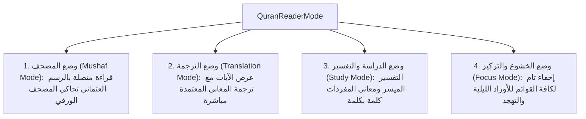
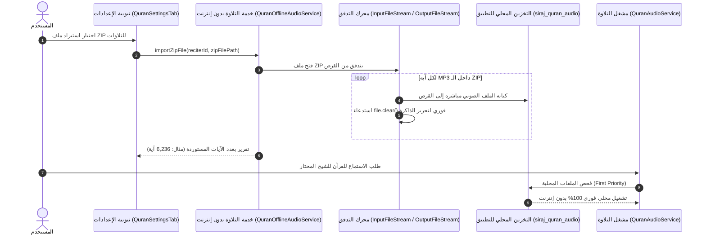
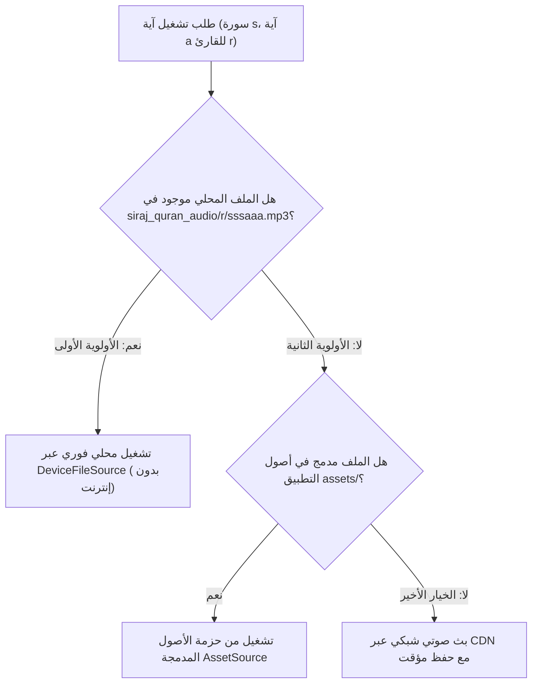

# 01 — منظومة القرآن الكريم الشاملة (Quran Subsystem Specification)

تُمثل وحدة القرآن الكريم الركيزة الكبرى في تطبيق **سِراج (SIRAJ)**، حيث تم تصميمها وهندستها لتوفير تجربة قراءة وتدبر واستماع وتسميع لا نظير لها، مع الالتزام الصارم بسلامة النص العثماني لحفص عن عاصم، والعمل التام بدون الحاجة لأي اتصال بالشبكة.

---

## 📖 1. البنية البيانية للنص القرآني المعتمد (Canonical Uthmani Dataset)

تعتمد المنظومة على قاعدة بيانات قرآنية موثقة ومطابقة لمصحف مجمع الملك فهد لطباعة المصحف الشريف بالمدينة المنورة:
- **إجمالي السور**: 114 سورة مكية ومدنية.
- **إجمالي الآيات**: 6,236 آية مرقمة بأسلوب الترقيم الكوفي المعتمد.
- **الأجزاء والأحزاب**: 30 جزءاً، 60 حزباً، و240 ربع حزب.
- **الصفحات القياسية**: 604 صفحات وفق تقسيم مصحف المدينة المنورة.
- **سجدات التلاوة**: 15 موضع سجود محدد بعلامات السجدة المعتمدة.
- **البسملة والفواصل**: معالجة البسملة كآية أولى في سورة الفاتحة ومفتتح لكافة السور الأخرى، مع ترقيم الآيات عبر الرموز المزخرفة الأصيلة ﴿١﴾.

---

## 🎨 2. أنماط القراءة الأربعة وهندسة الخطوط والطباعة (Modes & Typography)

### أنماط القراءة الأربعة (The 4 Quran Reader Modes):


### هندسة الخطوط العربية وسلامة اتصال الحروف (HarfBuzz & Ligature Integrity):
- **الخطوط المعتمدة**:
  1. **الأميري (Amiri)**: خط نسخي عثماني كلاسيكي يحاكي مصحف المدينة المنورة.
  2. **شهرزاد الجديد (Scheherazade New)**: خط مخصص للعرض الرقمي الدقيق للحركات وعلامات الضبط القرآني.
  3. **خط النظام (System Sans-Serif)**: خط بديل يلائم الشاشات ذات الكثافات المتغيرة.
- **حل معضلة اتصال الحروف (Ligature Preservation)**:
  - استخدام `Directionality(textDirection: TextDirection.rtl)` مع `Text.rich(TextSpan(...))` لضمان رسم الآية كفقرة عربية واحدة متصلة.
  - إلغاء تباين سماكات الخطوط (`FontWeight.bold`) داخل الكلمة الواحدة لتفادي كسر الـ Cursive Shaper في محرك HarfBuzz وظهور الحروف متقطعة أو منفصلة.

---

## 🌈 3. محرك أحكام التجويد الملون (Tajweed Rule Engine)

يدعم التطبيق 13 حكماً تجويدياً دقيقاً، مع الحفاظ على النص القرآني الأصيل دون أي تعديل في بايتات النص:

| الحكم التجويدي | المُعرّف (Rule ID) | اللون الدلالي | الكود اللوني (HEX) |
| :--- | :--- | :--- | :--- |
| **همزة وصل** | `hamzat_wasl` | رمادي هادئ | `#9E9E9E` |
| **لام شمسية** | `lam_shamsiyyah` | رمادي داكن | `#757575` |
| **حرف لا ينطق** | `silent` | رمادي متوسط | `#9CA3AF` |
| **غنة** | `ghunnah` | أخضر زمردي | `#10B981` |
| **إدغام بغنة** | `idgham_with_ghunnah` | أخضر عشبي | `#10B981` |
| **إدغام بغير غنة** | `idgham_without_ghunnah`| رمادي غامق | `#6B7280` |
| **إخفاء** | `ikhfa` | كهرماني / برتقالي | `#F59E0B` |
| **إقلاب** | `iqlab` | أزرق سماوي | `#3B82F6` |
| **قلقلة** | `qalqalah` | أزرق بحري | `#06B6D4` |
| **مد متصل** | `madd_muttasil` | أحمر قرمزي | `#EF4444` |
| **مد منفصل** | `madd_munfasil` | أحمر متوسط | `#DC2626` |
| **مد لازم** | `madd_lazim` | أحمر داكن | `#B91C1C` |
| **مد عارض للسكون** | `madd_arid` | وردي داكن | `#F43F5E` |

> **قاعدة الضبط**: يكون خيار التجويد الملون **معطلاً افتراضياً** للحفاظ على الرسم العثماني الصافي، وعند تفعيله يتم تلوين الحروف دون تغيير وزن الخط للحفاظ على اتصال الكلمة.

---

## 🎧 4. منظومة الصوتيات واستيراد حزم ZIP بدون إنترنت (Audio Engine & Offline Streaming)



### مميزات المنظومة الصوتية:
1. **استيراد حزم الـ ZIP بالتدفق المباشر (Disk-to-Disk Streaming)**:
   - فك ضغط ملفات ZIP الضخمة (تتجاوز 1.5 جيجابايت وتحتوي على آلاف الآيات من `001001.mp3` إلى `114006.mp3`) دون تحميلها في الذاكرة العشوائية (RAM).
   - انخفاض استهلاك الذاكرة من 1.5GB إلى **أقل من 5MB** فقط، مما يلغي تماماً خطأ نفاد الذاكرة (`OutOfMemoryError`).
2. **أداة تحميل السور عند الطلب (Surah Downloader Sheet)**:
   - واجهة منبثقة تفاعلية تتيح اختيار أي سورة للشيخ المختار وتحميل آياتها بنقرة واحدة، مع شريط تقدم مباشر وإمكانية الإلغاء.
3. **أولوية التشغيل المحلي الصارم**:
   - يتحقق المحرك عبر `QuranReciter.resolveCandidateUris` من وجود الملفات محلياً في مجلد التطبيق، ويقوم بتشغيلها فوراً عبر `DeviceFileSource` مع توفير استهلاك باقة الإنترنت بالكامل.
4. **مكتبة كبار القراء الموسعة (40+ خيار تلاوة لأشهر 30+ قارئاً)**:
   - **المصاحف المرتلة والمجودة والمعلمة**: الشيخ عبد الباسط عبد الصمد (مرتل ومجود)، الشيخ محمد صديق المنشاوي (مرتل ومجود ومعلم)، الشيخ محمود خليل الحصري (مرتل ومجود ومعلم)، الشيخ مصطفى إسماعيل (مجود)، الشيخ محمود علي البنا (مرتل)، الشيخ محمد محمود الطبلاوي (مرتل)، الشيخ أحمد نعينع (مجود)، والشيخ علي حجاج السويسي (مجود).
   - **أئمة الحرمين والعالم الإسلامي**: مشاري راشد العفاسي، عبد الرحمن السديس، سعود الشريم، ماهر المعيقلي، ياسر الدوسري، ناصر القطامي، أحمد بن علي العجمي، سعد الغامدي، أبو بكر الشاطري، علي الحذيفي، محمد أيوب، محمد جبريل، علي جابر، عبد الله بصفر، عبد الله مطرود، فارس عباد، هاني الرفاعي، خليفة الطنيجي، صلاح البدير، عبد الله عواد الجهني، إبراهيم الأخضر، خالد القحطاني، صلاح بو خاطر، عبد المحسن القاسم، ياسر سلامة، الدكتور أيمن رشدي سويد، عزيز عليلي، وسهل ياسين.
   - **التحقق والاعتمادية**: كافة روابط الـ CDN مفحوصة ومطابقة 100% لخوادم EveryAyah عالية النقاء بتنسيق الآيات المعياري `SSSAAA.mp3`.

---

## 📖 4.1. وضع التصفح الأفقي المتصل للمصحف (Continuous Mushaf Page-View)
- **العرض بدون حواف (Edge-to-Edge Mushaf Rendering)**: إزالة الحواف والإطارات الثقيلة لتقديم تجربة قراءة طبيعية تحاكي صفحات المصحف النبوي الشريف.
- **الانتقال المتصل بين السور (Seamless Cross-Surah Pagination)**:
  - عند الوصول إلى آخر صفحة في أي سورة (مثل سورة الفاتحة أو البقرة)، يتحول زر الصفحة التالية تلقائياً للانتقال إلى السورة التالية (سورة آل عمران) بسلاسة.
  - وبالمثل عند أول صفحة في السورة، ينتقل زر الصفحة السابقة تلقائياً إلى السورة السابقة دون الحاجة للخروج إلى الفهرس.
- **التوافق التام مع السمات البصرية**: تكيف ألوان حواف الصفحات وخلفيات الورق مع السمات الثلاث (الفاتحة العاجية، ورق المصحف السيبيا، والداكنة الليلية الخاشعة).

---

## 🎙️ 4.2. محرك التسميع الآلي والتعرف الصوتي المرن (Local AI Recitation Engine)
- **المطابقة الصوتية الآنية (Real-Time Acoustic Matching)**:
  - يعمل محرك التسميع الصوتي (`FastConformerRecitationGateway` و `QuranRecitationMatcher`) على معالجة الصوت محلياً على الجهاز فورياً.
- **نافذة الكلمات الثلاث المتزامنة (3-Word Sliding Window Flexibility)**:
  - يتعرف المحرك على الكلمة الحالية والكلمتين التاليتين في نفس الوقت. إذا تعثر القارئ في كلمة ونطق الكلمات التالية بشكل صحيح، تُحتسب الكلمات الصحيحة فوراً وتُلوّن الكلمة المفقودة باللون الأحمر، مما يمنح تجربة تسميع واقعية ومرنة لا تتعطل.
- **حفظ موارد الميكروفون (Robust Audio Lifecycle)**: منع توقف الميكروفون التلقائي أثناء فترات التفكير القصيرة وضمان استمرار جلسة التسميع حتى ينهيها المستخدم بنفسه.

## 🌐 5. الترجمات الـ 11 والتفاسير المعتمدة محلياً

تتضمن المنظومة ترجمات معتمدة بـ 11 لغة عالمية تعمل بالكامل دون اتصال:
1. **الإنجليزية (English)**: Saheeh International.
2. **الفرنسية (Français)**: Muhammad Hamidullah.
3. **الإسبانية (Español)**: Julio Cortes.
4. **الإندونيسية (Bahasa Indonesia)**: Indonesian Ministry of Religious Affairs (Kemenag).
5. **الأردية (اردو)**: Fateh Muhammad Jalandhry (اتجاه نصي RTL).
6. **التركية (Türkçe)**: Diyanet İşleri Başkanlığı.
7. **الروسية (Русский)**: Elmir Kuliev.
8. **البنغالية (বাংলা)**: Muhiuddin Khan & Mujibur Rahman.
9. **الصينية (中文)**: Muhammad Ma Jian.
10. **السويدية (Svenska)**: Knut Bernström.
11. **النطق الصوتي باللاتينية (Transliteration)**: للمسلمين الجدد والناطقين بغير العربية.

---

## 📑 6. واجهات التفاعل وإدارة التفضيلات (Quran UI & Settings Controller)

- **تبويبة الإعدادات الشاملة (`QuranSettingsTab`)**:
  - اختيار السمة البصرية، نوع الخط، حجم الخط (18px - 38px)، تباعد الأسطر (1.8x - 2.8x).
  - تفعيل/تعطيل الترجمة واختيار اللغة، إدارة القراء وسرعات التلاوة (0.75x - 2.0x).
  - إدارة التلاوات بدون إنترنت، استيراد ZIP، وتحميل السور.
  - قسم مخصص لاستعراض وحذف الفواصل المرجعية المحفوظة والانتقال المباشر للآية.
- **شاشة القارئ (`QuranReaderScreen`)**:
  - عرض رأس السورة مع معلومات النزول وعدد الآيات والصفحات.
  - قائمة سريعة للانتقال المباشر لأي سورة أو آية أو جزء.
  - شريط الاستماع السفلي مع مزامنة التمرير التلقائي أثناء التلاوة.
  - التبديل المباشر بين وضع التمرير الرأسي ووضع التقليب الأفقي المتصل عبر شريط التطبيق.
  - **هندسة شريط العنوان المرن (Zero Header Clipping)**: ضبط `centerTitle: false` وتغليف العنوان داخل `FittedBox(fit: BoxFit.scaleDown)` وضغط حشو أزرار الإجراءات عبر `VisualDensity.compact`، مما يضمن عرض اسم أي سورة بالكامل مهما طال اسمها ودون أي اقتطاع حتى على أصغر قياسات الشاشات (320px).

---

# 💻 الجزء الثاني: التفاصيل التقنية والتنفيذية البرمجية (Technical & Implementation Details)

## 🛠️ 1. خوارزمية استيراد وفك ضغط الـ ZIP بالتدفق من القرص للقرص

### كود تنفيذ خدمة التلاوة بدون إنترنت (`QuranOfflineAudioService`):
```dart
Future<QuranZipImportResult> importZipFile({
  required String reciterId,
  required String zipFilePath,
  void Function(int extractedCount)? onProgress,
}) async {
  await init();
  final targetDir = await getReciterDirectory(reciterId);

  try {
    final zipFile = File(zipFilePath);
    if (!zipFile.existsSync()) {
      return const QuranZipImportResult(
        isSuccess: false,
        errorMessage: 'ملف ZIP المحدد غير موجود على الجهاز.',
      );
    }

    // فتح ملف الـ ZIP بتدفق مباشر من القرص دون تحميله في RAM
    final input = InputFileStream(zipFilePath);
    final archive = ZipDecoder().decodeStream(input);

    int importedCount = 0;
    int totalBytes = 0;

    for (final file in archive) {
      if (file.isFile) {
        final name = file.name;
        final baseName = name.split(RegExp(r'[/\\]')).last.trim();

        if (baseName.toLowerCase().endsWith('.mp3')) {
          final destPath = '${targetDir.path}${Platform.pathSeparator}$baseName';
          final output = OutputFileStream(destPath);
          try {
            file.writeContent(output);
            importedCount++;
            totalBytes += file.size;
            onProgress?.call(importedCount);
          } finally {
            await output.close();
          }
          // تحرير الذاكرة العشوائية فوراً بعد كل ملف لمنع حدوث OutOfMemoryError
          file.clear();
        }
      }
    }

    await input.close();

    return QuranZipImportResult(
      isSuccess: importedCount > 0,
      importedVersesCount: importedCount,
      totalBytes: totalBytes,
      targetDirectory: targetDir.path,
    );
  } catch (e) {
    return QuranZipImportResult(
      isSuccess: false,
      errorMessage: 'حدث خطأ أثناء فك ضغط ملف ZIP: $e',
    );
  }
}
```

---

## 🔍 2. هرمية حل مصادر الصوت والتشغيل المحلي (`resolveCandidateUris`)



---

## 🎨 3. خوارزمية بناء نصوص التجويد دون كسر اتصال الحروف (`TajweedRenderer`)

```dart
static List<TextSpan> buildSpans({
  required String textUthmani,
  required List<dynamic>? rawRules,
  required TextStyle baseStyle,
  bool isDark = false,
}) {
  if (rawRules == null || rawRules.isEmpty) {
    return [TextSpan(text: textUthmani, style: baseStyle)];
  }

  final spans = rawRules.whereType<Map<String, dynamic>>().map(TajweedSpan.fromMap).toList()
    ..sort((a, b) => a.start.compareTo(b.start));

  final result = <TextSpan>[];
  int cursor = 0;

  for (final span in spans) {
    if (span.start < 0 || span.start > textUthmani.length || span.end > textUthmani.length || span.start >= span.end) {
      continue;
    }

    // إضافة النص غير الملون قبل الحكم
    if (span.start > cursor) {
      result.add(TextSpan(
        text: textUthmani.substring(cursor, span.start),
        style: baseStyle,
      ));
    }

    // إضافة حكم التجويد الملون مع الحفاظ على نفس وزن الخط ونوعه
    result.add(TextSpan(
      text: textUthmani.substring(span.start, span.end),
      style: baseStyle.copyWith(color: span.rule.color),
    ));

    cursor = span.end;
  }

  if (cursor < textUthmani.length) {
    result.add(TextSpan(text: textUthmani.substring(cursor), style: baseStyle));
  }

  return result;
}
```

---

# ⚖️ الجزء الثالث: الالتزامات والضوابط الإلزامية والمعايير الصارمة (Mandatory Invariants & Compliance Rules)

## 🚨 1. الالتزامات الشرعية والتقنية الصارمة للنص القرآني

1. **الامتناع المطلق عن تطبيع أو تنظيف التشكيل القرآني**:
   - يُمنع استخدام دوال حذف التشكيل (مثل إزالة التنوين أو الشدات أو علامات الوقف) على النصوص المعروضة في شاشات القراءة.
   - النص القرآني يجب أن يُقرأ ويُعرض ببايتاته الأصلية كما وردت في مصحف المدينة النبوية.
2. **عزل نصوص الترجمة والتفسير عن الرسم العثماني**:
   - يجب أن يُعرض النص العثماني داخل كتلة نصية مستقلة باتجاه `RTL`، بينما تُعرض الترجمات اللاتينية باتجاه `LTR` والترجمات اليمينية (كالأردية) باتجاه `RTL` في حاويات منفصلة تماماً.
3. **أولوية التشغيل المحلي الإلزامية**:
   - لا يجوز استهلاك أي باقة إنترنت لتشغيل آية محملة محلياً أو مستوردة من ملف ZIP.

---

## 🛑 2. موازنة الذاكرة والضوابط التشغيلية للصوتيات

1. **سقف الذاكرة الصارم (Heap Budget < 5MB for Audio Extraction)**:
   - يجب أن تستخدم كافة أدوات فك الضغط دفقاً مستمراً من القرص للقرص. أي كود يقوم باستدعاء `readAsBytes()` على ملفات الـ ZIP يُعد مخالفة جسيمة تتسبب في انهيار التطبيق على أجهزة المستخدمين.
2. **إلغاء التجويد الافتراضي (Default Tajweed Invariant)**:
   - يجب أن يبدأ إعداد `showTajweed` بالقيمة `false` افتراضياً لضمان عرض النص القرآني النقي الأصيل بأعلى درجات الراحة والانسيابية.
3. **التحقق من صحة أسماء ملفات الآيات المستوردة**:
   - يجب أن يطابق اسم الملف التنسيق القياسي `SSSAAA.mp3` (حيث SSS هو رقم السورة من 001 إلى 114، و AAA هو رقم الآية)، وتجاهل أي ملفات غير مطابقة لحماية النظام من الملفات المشبوهة.


