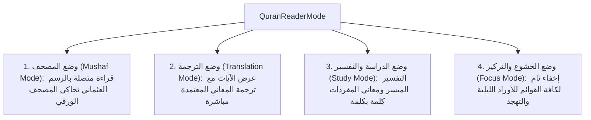
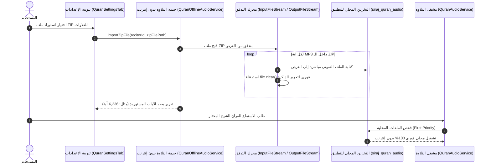

# 01 — منظومة القرآن الكريم الشاملة (Quran Subsystem Specification)

تُمثل وحدة القرآن الكريم الركيزة الكبرى في تطبيق **سِراج (SIRAJ)**، حيث تم تصميمها وهندستها لتوفير تجربة قراءة وتدبر واستماع وتسميع لا نظير لها، مع الالتزام الصارم بسلامة النص العثماني لحفص عن عاصم، والعمل التام بدون الحاجة لأي اتصال بالشبكة.

---

## 📖 1. البنية البيانية للنص القرآني المعتمد (Canonical Uthmani Dataset)

تعتمد المنظومة على قاعدة بيانات قرآنية موثقة ومطابقة لمصحف مجمع الملك فهد لطباعة المصحف الشريف بالمدينة المنورة:
- **إجمالي السور**: 114 سورة مكية ومدنية.
- **إجمالي الآيات**: 6,236 آية مرقمة بأسلوب الترقيم الكوفي المعتمد.
- **الأجزاء والأحزاب**: 30 جزءاً، 60 حزباً، و240 ربع حزب.
- **الصفحات القياسية**: 604 صفحات وفق تقسيم مصحف المدينة المنورة.
- **سجدات التلاوة**: 15 موضع سجود محدد بعلامات السجدة المعتمدة.
- **البسملة والفواصل**: معالجة البسملة كآية أولى في سورة الفاتحة ومفتتح لكافة السور الأخرى، مع ترقيم الآيات عبر الرموز المزخرفة الأصيلة ﴿١﴾.

---

## 🎨 2. أنماط القراءة الأربعة وهندسة الخطوط والطباعة (Modes & Typography)

### أنماط القراءة الأربعة (The 4 Quran Reader Modes):

### هندسة الخطوط العربية وسلامة اتصال الحروف (HarfBuzz & Ligature Integrity):
- **الخطوط المعتمدة**:
  1. **الأميري (Amiri)**: خط نسخي عثماني كلاسيكي يحاكي مصحف المدينة المنورة.
  2. **شهرزاد الجديد (Scheherazade New)**: خط مخصص للعرض الرقمي الدقيق للحركات وعلامات الضبط القرآني.
  3. **خط النظام (System Sans-Serif)**: خط بديل يلائم الشاشات ذات الكثافات المتغيرة.
- **حل معضلة اتصال الحروف (Ligature Preservation)**:
  - استخدام `Directionality(textDirection: TextDirection.rtl)` مع `Text.rich(TextSpan(...))` لضمان رسم الآية كفقرة عربية واحدة متصلة.
  - إلغاء تباين سماكات الخطوط (`FontWeight.bold`) داخل الكلمة الواحدة لتفادي كسر الـ Cursive Shaper في محرك HarfBuzz وظهور الحروف متقطعة أو منفصلة.

---

## 🌈 3. محرك أحكام التجويد الملون (Tajweed Rule Engine)

يدعم التطبيق 13 حكماً تجويدياً دقيقاً، مع الحفاظ على النص القرآني الأصيل دون أي تعديل في بايتات النص:

| الحكم التجويدي | المُعرّف (Rule ID) | اللون الدلالي | الكود اللوني (HEX) |
| :--- | :--- | :--- | :--- |
| **همزة وصل** | `hamzat_wasl` | رمادي هادئ | `#9E9E9E` |
| **لام شمسية** | `lam_shamsiyyah` | رمادي داكن | `#757575` |
| **حرف لا ينطق** | `silent` | رمادي متوسط | `#9CA3AF` |
| **غنة** | `ghunnah` | أخضر زمردي | `#10B981` |
| **إدغام بغنة** | `idgham_with_ghunnah` | أخضر عشبي | `#10B981` |
| **إدغام بغير غنة** | `idgham_without_ghunnah`| رمادي غامق | `#6B7280` |
| **إخفاء** | `ikhfa` | كهرماني / برتقالي | `#F59E0B` |
| **إقلاب** | `iqlab` | أزرق سماوي | `#3B82F6` |
| **قلقلة** | `qalqalah` | أزرق بحري | `#06B6D4` |
| **مد متصل** | `madd_muttasil` | أحمر قرمزي | `#EF4444` |
| **مد منفصل** | `madd_munfasil` | أحمر متوسط | `#DC2626` |
| **مد لازم** | `madd_lazim` | أحمر داكن | `#B91C1C` |
| **مد عارض للسكون** | `madd_arid` | وردي داكن | `#F43F5E` |

> **قاعدة الضبط**: يكون خيار التجويد الملون **معطلاً افتراضياً** للحفاظ على الرسم العثماني الصافي، وعند تفعيله يتم تلوين الحروف دون تغيير وزن الخط للحفاظ على اتصال الكلمة.

---

## 🎧 4. منظومة الصوتيات واستيراد حزم ZIP بدون إنترنت (Audio Engine & Offline Streaming)

### مميزات المنظومة الصوتية:
1. **استيراد حزم الـ ZIP بالتدفق المباشر (Disk-to-Disk Streaming)**:
   - فك ضغط ملفات ZIP الضخمة (تتجاوز 1.5 جيجابايت وتحتوي على آلاف الآيات من `001001.mp3` إلى `114006.mp3`) دون تحميلها في الذاكرة العشوائية (RAM).
   - انخفاض استهلاك الذاكرة من 1.5GB إلى **أقل من 5MB** فقط، مما يلغي تماماً خطأ نفاد الذاكرة (`OutOfMemoryError`).
2. **أداة تحميل السور عند الطلب (Surah Downloader Sheet)**:
   - واجهة منبثقة تفاعلية تتيح اختيار أي سورة للشيخ المختار وتحميل آياتها بنقرة واحدة، مع شريط تقدم مباشر وإمكانية الإلغاء.
3. **أولوية التشغيل المحلي الصارم**:
   - يتحقق المحرك عبر `QuranReciter.resolveCandidateUris` من وجود الملفات محلياً في مجلد التطبيق، ويقوم بتشغيلها فوراً عبر `DeviceFileSource` مع توفير استهلاك باقة الإنترنت بالكامل.
4. **كبار القراء المعتمدون**:
   - الشيخ عبد الباسط عبد الصمد، الشيخ محمود خليل الحصري، الشيخ محمد صديق المنشاوي، الشيخ مشاري العفاسي، الشيخ سعد الغامدي، الشيخ أبو بكر الشاطري، الشيخ علي الحذيفي، والشيخ ماهر المعيقلي.

---

## 🌐 5. الترجمات الـ 11 والتفاسير المعتمدة محلياً

تتضمن المنظومة ترجمات معتمدة بـ 11 لغة عالمية تعمل بالكامل دون اتصال:
1. **الإنجليزية (English)**: Saheeh International.
2. **الفرنسية (Français)**: Muhammad Hamidullah.
3. **الإسبانية (Español)**: Julio Cortes.
4. **الإندونيسية (Bahasa Indonesia)**: Indonesian Ministry of Religious Affairs (Kemenag).
5. **الأردية (اردو)**: Fateh Muhammad Jalandhry (اتجاه نصي RTL).
6. **التركية (Türkçe)**: Diyanet İşleri Başkanlığı.
7. **الروسية (Русский)**: Elmir Kuliev.
8. **البنغالية (বাংলা)**: Muhiuddin Khan & Mujibur Rahman.
9. **الصينية (中文)**: Muhammad Ma Jian.
10. **السويدية (Svenska)**: Knut Bernström.
11. **النطق الصوتي باللاتينية (Transliteration)**: للمسلمين الجدد والناطقين بغير العربية.

---

## 📑 6. واجهات التفاعل وإدارة التفضيلات (Quran UI & Settings Controller)

- **تبويبة الإعدادات الشاملة (`QuranSettingsTab`)**:
  - اختيار السمة البصرية، نوع الخط، حجم الخط (18px - 38px)، تباعد الأسطر (1.8x - 2.8x).
  - تفعيل/تعطيل الترجمة واختيار اللغة، إدارة القراء وسرعات التلاوة (0.75x - 2.0x).
  - إدارة التلاوات بدون إنترنت، استيراد ZIP، وتحميل السور.
  - قسم مخصص لاستعراض وحذف الفواصل المرجعية المحفوظة والانتقال المباشر للآية.
- **شاشة القارئ (`QuranReaderScreen`)**:
  - عرض رأس السورة مع معلومات النزول وعدد الآيات والصفحات.
  - قائمة سريعة للانتقال المباشر لأي سورة أو آية أو جزء.
  - شريط الاستماع السفلي مع مزامنة التمرير التلقائي أثناء التلاوة.

