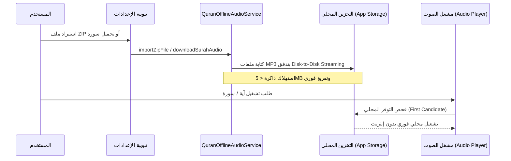

# 01 — منظومة القرآن الكريم (Quran Subsystem)

تعد وحدة القرآن الكريم قلب تطبيق **سِراج**، حيث تم بناؤها لتوفر تجربة قراءة واستماع وتدبر بالغة الرقي مع الالتزام التام بسلامة الرسم العثماني لحفص عن عاصم.

---

## 📖 مكونات المصحف والقراءة (Mushaf & Typography)
1. **النص القرآني المعتمد (Uthmani Hafs Dataset)**:
   - 114 سورة، 6,236 آية، 30 جزءاً، 604 صفحات، مع علامات الأجزاء والأحزاب وأرقام الآيات المزخرفة ﴿١﴾.
   - الخطوط المعتمدة: **الأميري (Amiri)** (مصحف المدينة المنورة)، **شهرزاد الجديد (ScheherazadeNew)**، وخط النظام.
2. **أنماط القراءة الأربعة (Reading Modes)**:
   - **وضع المصحف (Mushaf)**: قراءة متصلة بالرسم العثماني.
   - **وضع الترجمة (Translation)**: عرض ترجمة معاني الآيات أسفل كل آية فوراً وبخط مستقل.
   - **وضع الدراسة والتفسير (Study)**: أدوات التفسير الميسر، ومعاني الكلمات المفردة، وتكرار الآيات.
   - **وضع الخشوع والتركيز (Focus)**: إخفاء كافة الأشرطة والأزرار لصفاء الذهن أثناء القراءة.
3. **سلامة واتصال الحروف العربية**:
   - استخدام `Directionality(textDirection: TextDirection.rtl)` مع `Text.rich(TextSpan(...))` لضمان اتصال الحروف وعدم تقطع الكلمات.
   - التجويد الملون لا يغير سماكة الحروف للحفاظ على اتصال رسم الكلمة وتناسقها.

---

## 🎧 منظومة الصوتيات والتلاوة بدون إنترنت (Audio Engine & Offline Recitations)

### 1. استيراد حزم التلاوة (Local ZIP Package Import)
- استيراد ملف ZIP من جهاز المستخدم يحتوي على ملفات الآيات (من `001001.mp3` إلى `114006.mp3`).
- **تقنية التدفق المباشر**: استخدام `InputFileStream` و `OutputFileStream` مع `file.clear()` لمنع خطأ نفاد الذاكرة (`OutOfMemoryError`)، مما يسمح بفك ضغط ملفات تفوق 1.5 جيجابايت باستهلاك ذاكرة أقل من 5 ميجابايت.

### 2. تحميل السور عند الطلب (On-Demand Surah Downloader)
- نافذة منبثقة تفاعلية لاختيار وتحميل أي سورة للشيخ المختار مباشرة إلى ذاكرة الجهاز.
- شريط تقدم حي لحالة تحميل الآيات مع وسم أخضر (محمّلة) عند اكتمال السورة.

### 3. كبار القراء المعتمدون
- الشيخ عبد الباسط عبد الصمد (المصحف المرتل - متوفر محلياً).
- الشيخ محمود خليل الحصري.
- الشيخ محمد صديق المنشاوي.
- الشيخ مشاري راشد العفاسي.
- الشيخ سعد الغامدي، الشيخ أبو بكر الشاطري، الشيخ علي الحذيفي، والشيخ ماهر المعيقلي.

---

## 🌐 ترجمة المعاني المدمجة محلياً (11 Languages)
تتوفر 11 لغة معتمدة مدمجة بالكامل دون الحاجة لأي اتصال بالإنترنت:
- الإنجليزية (English - Saheeh International).
- الفرنسية (Français - Hamidullah).
- الإسبانية (Español - Cortes).
- الإندونيسية (Bahasa Indonesia - Kemenag).
- الأردية (اردو - Jalandhry - RTL).
- التركية (Türkçe - Diyanet).
- الروسية (Русский - Kuliev).
- البنغالية (বাংলা - Mujibur).
- الصينية (中文 - Ma Jian).
- السويدية (Svenska - Bernström).
- النطق الصوتي بالحروف اللاتينية (Transliteration).
