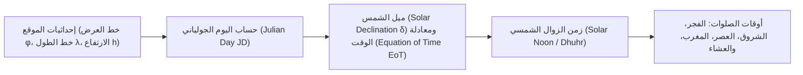
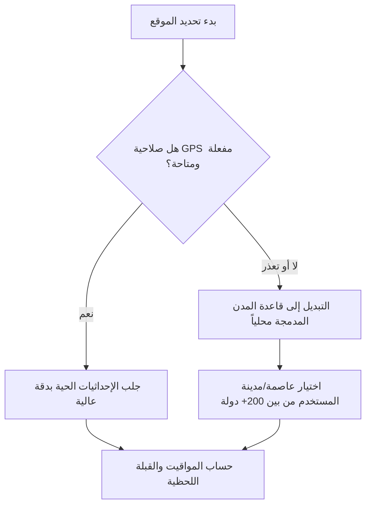

# 02 — مواقيت الصلاة والقبلة والأذان (Prayer, Qibla & Athan Subsystem)

تُمثل وحدة الصلاة والقبلة في تطبيق **سِراج (SIRAJ)** نظاماً فلكياً وجغرافياً عالي الدقة يعمل باستقلالية تامة عن الإنترنت لحساب مواقيت الصلوات الخمس والشروق، وتحديد اتجاه القبلة، وجدولة التنبيهات والأذان في أي نقطة جغرافية على سطح الأرض.

---

## 🔭 1. المعادلات الفلكية الدقيقة لمواقيت الصلاة (Astronomical Calculations)

يعتمد المحرك على حساب الموضع اللحظي للشمس نسبةً لإحداثيات الموقع وزمن اليوم:

### المعادلات الرياضية الحاكمة:
1. **زمن الزوال الشمسي (Dhuhr / Solar Noon)**:
   $$T_{\text{Dhuhr}} = 12 + \text{Timezone} - \frac{\lambda}{15} - \frac{\text{EoT}}{60}$$
2. **وقت صلاة العصر (Asr Shadow Calculation)**:
   - يُحسب عندما يصبح طول ظل الشاخص مساوياً لطول ظله وقت الزوال مضافاً إليه طول الشاخص (أو مثليه في المذهب الحنفي):
   $$A = \text{arccot}(N + \tan|\phi - \delta|)$$
   $$\text{حيث } N = 1 \text{ (جمهور الفقهاء: شافعي، مالكي، حنبلي)، } N = 2 \text{ (المذهب الحنفي)}$$
   $$T_{\text{Asr}} = T_{\text{Dhuhr}} + \frac{1}{15} \arccos\left(\frac{\sin A - \sin\phi \sin\delta}{\cos\phi \cos\delta}\right)$$
3. **أوقات الفجر والشروق والمغرب والعشاء (Twilight Angles)**:
   - زاوية الارتفاع الشمسي للزاوية $\alpha$:
   $$T(\alpha) = T_{\text{Dhuhr}} \pm \frac{1}{15} \arccos\left(\frac{\sin(-\alpha) - \sin\phi \sin\delta}{\cos\phi \cos\delta}\right)$$
   - **الشروق والمغرب**: $\alpha = 0.833^\circ + 0.0347 \sqrt{h}$ (مع تصحيح انكسار الغلاف الجوي والارتفاع).
   - **الفجر والعشاء**: بحسب زاوية الشفق الفلكي المعتمدة لكل هيئة.

---

## 🕌 2. الهيئات الفلكية المعتمدة والتعديلات الفقهية

| الهيئة الفلكية | زاوية الفجر ($\alpha_{\text{Fajr}}$) | زاوية العشاء ($\alpha_{\text{Isha}}$) | ملاحظات وقواعد إضافية |
| :--- | :--- | :--- | :--- |
| **الهيئة العامة المصرية للمساحة** | $19.5^\circ$ | $17.5^\circ$ | المعتمدة في مصر، إفريقيا، وأجزاء من الشام |
| **رابطة العالم الإسلامي (MWL)** | $18.0^\circ$ | $17.0^\circ$ | المعتمدة في أوروبا، وأغلب أنحاء العالم |
| **جامعة أم القرى (مكة المكرمة)** | $18.5^\circ$ | ثابت (بعد المغرب) | العشاء بعد المغرب بـ 90 دقيقة (120 في رمضان) |
| **الجمعية الإسلامية لأمريكا الشمالية (ISNA)** | $15.0^\circ$ | $15.0^\circ$ | المعتمدة في الولايات المتحدة الأمريكية وكندا |
| **جامعة العلوم الإسلامية بكراتشي** | $18.0^\circ$ | $18.0^\circ$ | المعتمدة في باكستان، الهند، بنغلاديش، وأفغانستان |

### تعديلات خطوط العرض العليا (High Latitude Adjustments):
في المناطق الشمالية والجنوبية (أكثر من $48^\circ$) حيث يختفي الشفق الفلكي صيفاً:
1. **قاعدة زاوية الليل (Angle-Based Rule)**: تقسيم الليل بنسبة الزاوية الفلكية إلى $60^\circ$.
2. **قاعدة نصف الليل (Midnight Rule)**: اعتبار منتصف الليل حداً فاصلاً بين الفجر والعشاء.
3. **قاعدة سبع الليل (One-Seventh Rule)**: تخصيص السبع الأخير للفجر والسبع الأول للعشاء.

---

## 📍 3. التحكيم الذكي للموقع وقاعدة بيانات المدن المحلية (Location Engine)

- **قاعدة بيانات مدن العالم المحلية المدمجة**:
  - تضم إحداثيات (خط العرض، خط الطول، الارتفاع، والمنطقة الزمنية) لكافة عواصم العالم والمدن الإسلامية الكبرى.
  - تعمل محلياً 100% وتلغي الحاجة لأي اتصال بالإنترنت أو الاعتماد الحصري على خدمات جوجل للموقع.

---

## 🧭 4. محرك زاوية القبلة وتنعيم المستشعرات (Qibla & Sensor Fusion)

### معادلة الدائرة العظمى لزاوية القبلة (Orthodromic Azimuth):
يتم حساب الزاوية الدقيقة باتجاه الكعبة المشرفة في مكة المكرمة ($\phi_k = 21.422487^\circ\text{ N}, \lambda_k = 39.826206^\circ\text{ E}$):

$$\theta = \text{atan2}\left(\sin(\lambda_k - \lambda), \cos\phi \tan\phi_k - \sin\phi \cos(\lambda_k - \lambda)\right)$$

### دمج وتنعيم المستشعرات (Sensor Fusion & Filtering):
- **تصفية الاهتزازات (Low-Pass Filter)**:
  - معالجة قراءات البوصلة ومقياس المغناطيسية عبر مرشح تمرير منخفض ($\alpha = 0.15$) لمنع القفزات اللحظية الناتجة عن حركة اليد.
- **التعويض عن الميلان (Tilt Compensation)**:
  - دمج قراءات مقياس التسارع (Accelerometer) لتصحيح زاوية الرؤية حتى لو لم يكن الهاتف موضوعاً بشكل أفقي تماماً.
- **كشف التداخل المغناطيسي (Magnetic Interference Detection)**:
  - تنبيه المستخدم فوراً عند استشعار حقول كهرومغناطيسية قريبة مع رسم متحرك يوضح كيفية معايرة البوصلة بحركة الرقم 8.

---

## 🔔 5. منظومة الأذان وجدولة التنبيهات (Athan & Alarms)

- **الجدولة المسبقة بدون إنترنت**:
  - يقوم التطبيق بحساب وجدولة مواعيد الأذان للأيام القادمة مسبقاً عبر نظام المنبهات الدقيقة (Exact Alarms).
- **أصوات الأذان والتنبيهات المعتمدة**:
  - أذان الحرم المكي الشريف.
  - أذان المسجد النبوي الشريف.
  - أذان المسجد الأقصى المبارك.
  - أذان القاهرة (مصر).
- **خيارات التخصيص الكاملة**:
  - تنبيه صوتي كامل بالأذان، أو تكبيرات مقتضبة، أو تنبيه صامت مع اهتزاز.
  - تنبيه مسبق قبل دخول وقت الصلاة بـ 15 دقيقة للاستعداد للوضوء والذهاب للمسجد.
  - تنبيه خاص لشروق الشمس وقيام الليل والثلث الأخير.

