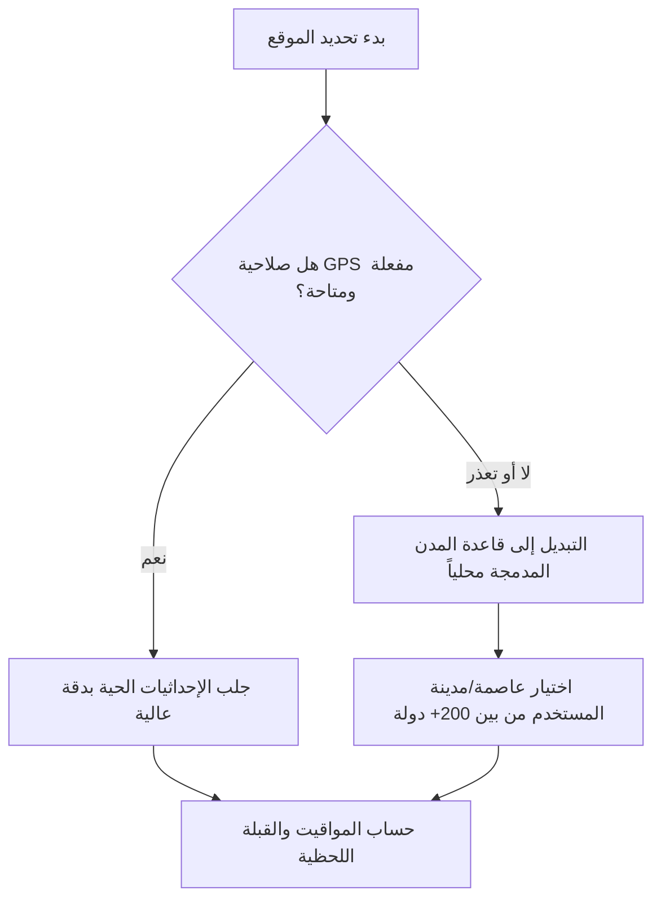
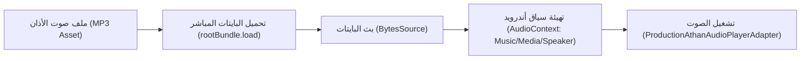

# 02 — مواقيت الصلاة والقبلة والأذان (Prayer, Qibla & Athan Subsystem)

تُمثل وحدة الصلاة والقبلة في تطبيق **سِراج (SIRAJ)** نظاماً فلكياً وجغرافياً عالي الدقة يعمل باستقلالية تامة عن الإنترنت لحساب مواقيت الصلوات الخمس والشروق، وتحديد اتجاه القبلة، وجدولة التنبيهات والأذان في أي نقطة جغرافية على سطح الأرض.

---

## 🔭 1. المعادلات الفلكية الدقيقة لمواقيت الصلاة (Astronomical Calculations)

يعتمد المحرك على حساب الموضع اللحظي للشمس نسبةً لإحداثيات الموقع وزمن اليوم:


### المعادلات الرياضية الحاكمة:
1. **زمن الزوال الشمسي (Dhuhr / Solar Noon)**:
   $$T_{\text{Dhuhr}} = 12 + \text{Timezone} - \frac{\lambda}{15} - \frac{\text{EoT}}{60}$$
2. **وقت صلاة العصر (Asr Shadow Calculation)**:
   - يُحسب عندما يصبح طول ظل الشاخص مساوياً لطول ظله وقت الزوال مضافاً إليه طول الشاخص (أو مثليه في المذهب الحنفي):
   $$A = \text{arccot}(N + \tan|\phi - \delta|)$$
   $$\text{حيث } N = 1 \text{ (جمهور الفقهاء: شافعي، مالكي، حنبلي)، } N = 2 \text{ (المذهب الحنفي)}$$
   $$T_{\text{Asr}} = T_{\text{Dhuhr}} + \frac{1}{15} \arccos\left(\frac{\sin A - \sin\phi \sin\delta}{\cos\phi \cos\delta}\right)$$
3. **أوقات الفجر والشروق والمغرب والعشاء (Twilight Angles)**:
   - زاوية الارتفاع الشمسي للزاوية $\alpha$:
   $$T(\alpha) = T_{\text{Dhuhr}} \pm \frac{1}{15} \arccos\left(\frac{\sin(-\alpha) - \sin\phi \sin\delta}{\cos\phi \cos\delta}\right)$$
   - **الشروق والمغرب**: $\alpha = 0.833^\circ + 0.0347 \sqrt{h}$ (مع تصحيح انكسار الغلاف الجوي والارتفاع).
   - **الفجر والعشاء**: بحسب زاوية الشفق الفلكي المعتمدة لكل هيئة.

---

## 🕌 2. الهيئات الفلكية المعتمدة والتعديلات الفقهية

| الهيئة الفلكية | زاوية الفجر ($\alpha_{\text{Fajr}}$) | زاوية العشاء ($\alpha_{\text{Isha}}$) | ملاحظات وقواعد إضافية |
| :--- | :--- | :--- | :--- |
| **الهيئة العامة المصرية للمساحة** | $19.5^\circ$ | $17.5^\circ$ | المعتمدة في مصر، إفريقيا، وأجزاء من الشام |
| **رابطة العالم الإسلامي (MWL)** | $18.0^\circ$ | $17.0^\circ$ | المعتمدة في أوروبا، وأغلب أنحاء العالم |
| **جامعة أم القرى (مكة المكرمة)** | $18.5^\circ$ | ثابت (بعد المغرب) | العشاء بعد المغرب بـ 90 دقيقة (120 في رمضان) |
| **الجمعية الإسلامية لأمريكا الشمالية (ISNA)** | $15.0^\circ$ | $15.0^\circ$ | المعتمدة في الولايات المتحدة الأمريكية وكندا |
| **جامعة العلوم الإسلامية بكراتشي** | $18.0^\circ$ | $18.0^\circ$ | المعتمدة في باكستان، الهند، بنغلاديش، وأفغانستان |

### تعديلات خطوط العرض العليا (High Latitude Adjustments):
في المناطق الشمالية والجنوبية (أكثر من $48^\circ$) حيث يختفي الشفق الفلكي صيفاً:
1. **قاعدة زاوية الليل (Angle-Based Rule)**: تقسيم الليل بنسبة الزاوية الفلكية إلى $60^\circ$.
2. **قاعدة نصف الليل (Midnight Rule)**: اعتبار منتصف الليل حداً فاصلاً بين الفجر والعشاء.
3. **قاعدة سبع الليل (One-Seventh Rule)**: تخصيص السبع الأخير للفجر والسبع الأول للعشاء.

---

## 📍 3. التحكيم الذكي للموقع وقاعدة بيانات المدن المحلية (Location Engine)



- **قاعدة بيانات مدن العالم المحلية المدمجة**:
  - تضم إحداثيات (خط العرض، خط الطول، الارتفاع، والمنطقة الزمنية) لكافة عواصم العالم والمدن الإسلامية الكبرى.
  - تعمل محلياً 100% وتلغي الحاجة لأي اتصال بالإنترنت أو الاعتماد الحصري على خدمات جوجل للموقع.

---

## 🧭 4. محرك زاوية القبلة وتنعيم المستشعرات (Qibla & Sensor Fusion)

### معادلة الدائرة العظمى لزاوية القبلة (Orthodromic Azimuth):
يتم حساب الزاوية الدقيقة باتجاه الكعبة المشرفة في مكة المكرمة ($\phi_k = 21.422487^\circ\text{ N}, \lambda_k = 39.826206^\circ\text{ E}$):

$$\theta = \text{atan2}\left(\sin(\lambda_k - \lambda), \cos\phi \tan\phi_k - \sin\phi \cos(\lambda_k - \lambda)\right)$$

### دمج وتنعيم المستشعرات (Sensor Fusion & Filtering):
- **تصفية الاهتزازات (Low-Pass Filter)**:
  - معالجة قراءات البوصلة ومقياس المغناطيسية عبر مرشح تمرير منخفض ($\alpha = 0.15$) لمنع القفزات اللحظية الناتجة عن حركة اليد.
- **التعويض عن الميلان (Tilt Compensation)**:
  - دمج قراءات مقياس التسارع (Accelerometer) لتصحيح زاوية الرؤية حتى لو لم يكن الهاتف موضوعاً بشكل أفقي تماماً.
- **كشف التداخل المغناطيسي (Magnetic Interference Detection)**:
  - تنبيه المستخدم فوراً عند استشعار حقول كهرومغناطيسية قريبة مع رسم متحرك يوضح كيفية معايرة البوصلة بحركة الرقم 8.

---

## 🔔 5. منظومة الأذان وجدولة التنبيهات (Athan & Alarms)

- **الجدولة المسبقة بدون إنترنت**:
  - يقوم التطبيق بحساب وجدولة مواعيد الأذان للأيام القادمة مسبقاً عبر نظام المنبهات الدقيقة (Exact Alarms).
- **أصوات الأذان والتنبيهات المعتمدة**:
  - أذان الحرم المكي الشريف.
  - أذان المسجد النبوي الشريف.
  - أذان المسجد الأقصى المبارك.
  - أذان القاهرة (مصر).
- **خيارات التخصيص الكاملة**:
  - تنبيه صوتي كامل بالأذان، أو تكبيرات مقتضبة، أو تنبيه صامت مع اهتزاز.
  - تنبيه مسبق قبل دخول وقت الصلاة بـ 15 دقيقة للاستعداد للوضوء والذهاب للمسجد.

---

## 🎵 6. محرك صوت الأذان والبايتات المباشرة (Athan Audio Engine Architecture)



- **تضمين الصوت المعتمد**:
  - تم تضمين وتسجيل ملف صوت الأذان الكامل بصوت **الشيخ عبد الباسط عبد الصمد** محلياً داخل التطبيق: [`assets/audio/athan_abdulbasit.mp3`](file:///d:/Downloads/Downloads/projects/SIRAJ/assets/audio/athan_abdulbasit.mp3).
- **موثوقية التشغيل عبر المنصات (Cross-Platform Audio Reliability)**:
  - تهيئة إعدادات الصوت لنظام أندرويد `AudioContext` مع ضبط الاستخدام كـ `AndroidUsageType.media` وتركيز الصوت `AndroidAudioFocus.gain`.
  - تحميل مصفوفة البايتات مباشرة من الحزمة وتمريرها عبر `BytesSource` لضمان تشغيل فوري بدون تأخير أو أخطاء تعليق مشغل الوسائط على كافة إصدارات نظام Android و iOS.
  - دعم التخصيص الكامل: الأذان كاملاً، التكبيرات فقط، التنبيه الصامت، أو الإشعار النصي.

---

## ⏱️ 7. العداد التنازلي الحي لمواقيت الصلاة (Live Real-Time Countdown & Auto-Advance)

- **مؤقت النبضات الدوري (1-Second Real-Time Ticker)**:
  - تعمل شاشة الصلاة بمؤقت داخلي دوري (`Timer.periodic(1 sec)`) يقوم بتحديث العداد التنازلي للصلاة القادمة (`HH:MM:SS`) في الوقت الحقيقي تلقائياً دون الحاجة لمغادرة التبويبة أو السحب لإعادة التحميل.
- **الانتقال التلقائي للطور التالي (Seamless Prayer Phase Transition)**:
  - فور وصول العداد التنازلي إلى نقطة الصفر (`00:00:00`) وتجاوز وقت الصلاة الحالي، يقوم النظام تلقائياً وبشكل آني بإعادة حساب الحالة وتحويل الصلاة المنقضية إلى مرحلة الأداء/التتبع وتفعيل الصلاة القادمة مباشرة.

---

## 💾 8. الحفظ التلقائي للموقع الجغرافي وبث الإحداثيات (Location Persistence & Live Streams)

- **الحفظ المحلي الدائم (`mod_location`)**:
  - يتم تخزين آخر موقع تم التوصل إليه (سواء عبر GPS التلقائي أو الاختيار اليدوي) في مساحة التخزين المعزولة `mod_location` بصيغة JSON.
  - عند إعادة فتح التطبيق، يتم استرجاع الموقع المحفوظ فوراً دون أي انتظار لإظهار مواقيت الصلاة الصحيحة لحظة الإقلاع.
- **الاستكشاف التلقائي في الخلفية (Background Auto-Acquisition)**:
  - عند إقلاع التطبيق، يقوم `LocationEngine` تلقائياً بطلب إحداثيات GPS المحدثة في الخلفية، ويبث الإحداثيات الجديدة عبر `locationStream` فور ورودها، مما يؤدي لتحديث جداول الصلاة والقبلة تلقائياً وبشكل متجاوب.

---

# 💻 الجزء الثاني: التفاصيل التقنية والتنفيذية البرمجية (Technical & Implementation Details)

## 🛠️ 1. خوارزمية الحساب الفلكي البرمجية (`PrayerCalculationEngine`)

```dart
class PrayerCalculationEngine {
  /// تحويل التاريخ والوقت إلى اليوم الجولياني (Julian Day)
  static double getJulianDay(DateTime date) {
    int year = date.year;
    int month = date.month;
    final day = date.day + (date.hour + date.minute / 60.0) / 24.0;

    if (month <= 2) {
      year -= 1;
      month += 12;
    }
    final a = (year / 100).floor();
    final b = 2 - a + (a / 4).floor();
    return (365.25 * (year + 4716)).floor() + (30.6001 * (month + 1)).floor() + day + b - 1524.5;
  }

  /// حساب زاوية القبلة العظمى بدقة الراديان
  static double calculateQiblaAzimuth({required double latitude, required double longitude}) {
    const kaabaLat = 21.422487 * (pi / 180.0);
    const kaabaLng = 39.826206 * (pi / 180.0);
    final userLat = latitude * (pi / 180.0);
    final userLng = longitude * (pi / 180.0);

    final dLng = kaabaLng - userLng;
    final y = sin(dLng);
    final x = cos(userLat) * tan(kaabaLat) - sin(userLat) * cos(dLng);
    final qiblaRad = atan2(y, x);
    return (qiblaRad * (180.0 / pi) + 360.0) % 360.0;
  }
}
```

---

## 🧭 2. خوارزمية تنعيم المستشعرات (Low-Pass Heading Filter)

```dart
class CompassSensorFilter {
  double _filteredHeading = 0.0;
  static const double _alpha = 0.15; // معامل التنعيم اللحظي

  double updateHeading(double rawHeading) {
    // معالجة الانتقال الدائري بين 0 و 360 درجة
    double diff = rawHeading - _filteredHeading;
    while (diff < -180.0) diff += 360.0;
    while (diff > 180.0) diff -= 360.0;

    _filteredHeading = (_filteredHeading + _alpha * diff + 360.0) % 360.0;
    return _filteredHeading;
  }
}
```

---

## 🏙️ 3. بنية قاعدة بيانات المدن المحلية المدمجة (`cities_db.json`)

```json
[
  {
    "id": "cairo_eg",
    "nameArabic": "القاهرة",
    "nameEnglish": "Cairo",
    "countryCode": "EG",
    "latitude": 30.0444,
    "longitude": 31.2357,
    "elevation": 23.0,
    "timezone": "Africa/Cairo",
    "defaultMethod": "egyptian"
  },
  {
    "id": "makkah_sa",
    "nameArabic": "مكة المكرمة",
    "nameEnglish": "Makkah",
    "countryCode": "SA",
    "latitude": 21.4225,
    "longitude": 39.8262,
    "elevation": 277.0,
    "timezone": "Asia/Riyadh",
    "defaultMethod": "ummAlQura"
  }
]
```

---

# ⚖️ الجزء الثالث: الالتزامات والضوابط الإلزامية والمعايير الصارمة (Mandatory Invariants & Compliance Rules)

## 🚨 1. الالتزامات الشرعية والفلكية الصارمة

1. **معيار الدقة الفلكية (Precision Invariant $\le 1 \text{ min}$)**:
   - يجب أن تطابق نتائج حسابات مواقيت الصلاة التقاويم الرسمية للهيئات المعتمدة بهامش خطأ أقصاه **دقيقة واحدة فقط**.
2. **التحكيم الفوري بدون انقطاع (Fail-Safe Location Invariant)**:
   - في حال تعذر الحصول على إحداثيات GPS (بسبب رفض الإذن أو إغلاق الموقع)، يُحظر ترك الشاشة فارغة أو إظهار رسائل خطأ، ويجب التبديل فوراً إلى المدينة الافتراضية المحددة أو آخر موقع معروف.
3. **التنبيه المبكر لوقت الصلاة (Prayer Horizon Boundary)**:
   - يُلزم النظام باحتساب وحفظ أوقات الصلاة لـ 30 يوماً قادمة محلياً لضمان استمرار الأذان والتنبيهات حتى لو لم يفتح المستخدم التطبيق لأسابيع.

---

## 🛑 2. الضوابط التشغيلية للمستشعرات والبطارية

1. **إيقاف المستشعرات فور مغادرة الشاشة (Sensor Battery Drain Prevention)**:
   - يجب إلغاء اشتراك مستشعرات البوصلة والجيروسكوب فور انتقال المستخدم خارج شاشة القبلة لمنع استنزاف بطارية الهاتف.
2. **تحرير أقفال التنبيه (WakeLock Release)**:
   - يجب تحرير أي `WakeLock` فور انتهاء تشغيل صوت الأذان في الخلفية، مع عدم تشغيل أصوات الأذان أثناء المكالمات الهاتفية أو وضع الصامت التام للنظام.


