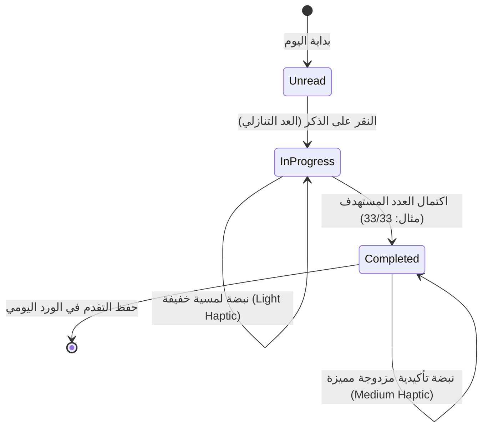
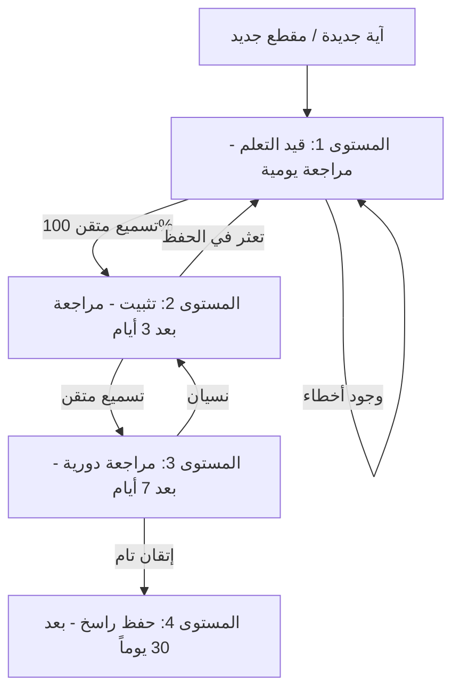
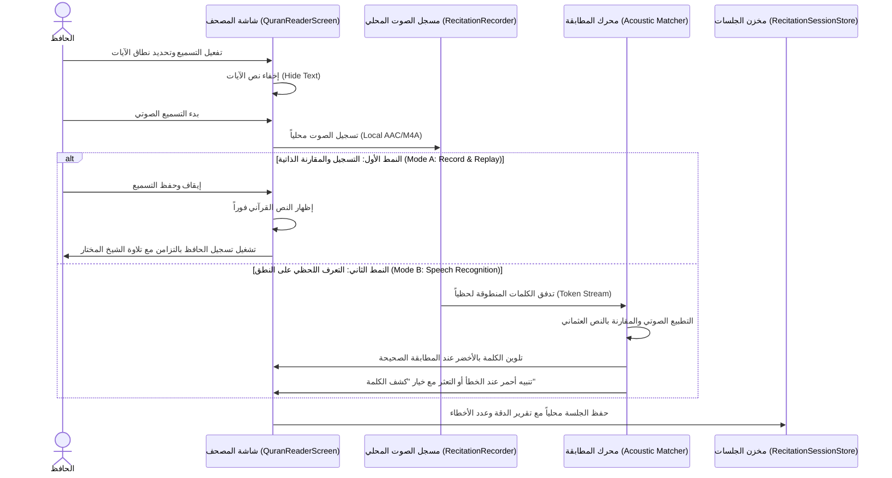

# 03 — منظومة الأذكار والتسميع والتحفيظ (Azkar, Recitation & Memorization)

تجمع هذه المنظومة في تطبيق **سِراج (SIRAJ)** بين ركنين أساسيين: **الأذكار والأدعية اليومية الصحيحة الموثقة من حصن المسلم**، و**استديو التحفيظ والتسميع الصوتي الذكي** القائم على خوارزميات التكرار المتباعد والتعرف اللحظي على الكلمات القرآنية محلياً.

---

## 📿 1. قاعدة بيانات حصن المسلم الموثقة (Authentic Adhkar Dataset)

تعتمد المنظومة على قاعدة بيانات موثقة ومحققة لأذكار وأدعية الكتاب والسنة المطهرة:
- **الموقع المصدري**: `lib/modules/adhkar/`
- **أهم الأبواب والتصنيفات**:
  1. **أذكار الصباح والمساء**: الأوراد اليومية مع فضل كل ذكر وعدد تكراره.
  2. **أذكار النوم والاستيقاظ**: أذكار الفراش، القلق والاضطراب في النوم، ورؤية الرؤيا.
  3. **أذكار الصلوات المفروضة**: أذكار ما بعد السلام، التسبيح، وأدعية صلاة الوتر والقنوت.
  4. **أدعية المسجد والوضوء والخلاء**: دعاء الذهاب للمسجد، الدخول والخروج، ودعاء الفراغ من الوضوء.
  5. **أدعية الأحوال والمناسبات**: الاستخارة، الكرب، السفر، المرض والرقية الشرعية، والأمطار والرياح.
- **التوثيق والتخريج الحديثي**:
  - يحتوي كل ذكر على النص العربي المشكول بدقة، الترجمة الصوتية والإنجليزية، درجة صحة الحديث، والمصدر الأصلي (صحيح البخاري، صحيح مسلم، سنن أبي داود، جامع الترمذي، ومسند أحمد).

---

## 📱 2. واجهة الأذكار التفاعلية والعدادات الذكية (Interactive Counter & Haptics)



### مزايا العداد الذكي:
- **التغذية اللمسية التفاعلية (Haptic Feedback)**:
  - نبضة خفيفة عند كل نقرة للعد دون الحاجة للنظر إلى الشاشة.
  - نبضة تأكيدية قوية واحتفالية بصرية ناعمة عند اكتمال تكرار الذكر والانتقال للذكر التالي تلقائياً.
- **حفظ ومتابعة التقدم (Daily Streak & Progress)**:
  - حفظ تقدم القراءة لحظياً عبر `KeyValueStore`.
  - شريط إنجاز يومي يوضح نسبة اكتمال أذكار الصباح وأذكار المساء.

---

## 🧠 3. محرك التحفيظ والتكرار المتباعد (Spaced Repetition Engine - SRS)

يعتمد نظام الحفظ في **سِراج** على خوارزمية ذكية مستوحاة من منحنى النسيان لإبنجهاوس (Ebbinghaus Forgetting Curve) لترسيخ الآيات في الذاكرة طويلة المدى:



### تصنيفات الحفظ والمراجعة:
1. **جديد (New)**: آيات مضافة لخطة الحفظ لم تبدأ مراجعتها بعد.
2. **قيد الحفظ (Learning)**: آيات تتم مراجعتها يومياً لترسيخ البدايات.
3. **قيد المراجعة (Reviewing)**: آيات تمت مراجعتها وتتم جدولتها كل عدة أيام.
4. **راسخ ومتقن (Mastered)**: آيات أتم الحافظ تسميعها دون أي خطأ لعدة دورات متتالية.

---

## 🎙️ 4. استديو التسميع الصوتي والتحقق اللحظي (In-Place Recitation Studio)

يتضمن تطبيق **سِراج** استديو تسميع مدمج مباشرة داخل شاشة المصحف الشريف (`QuranReaderScreen`) يتيح للحافظ التسميع واختبار حفظه بنمطين متقدمين:



### الخصائص الهندسية لاستديو التسميع:
1. **الخصوصية التامة 100%**: كافة التسجيلات الصوتية والتحليلات تتم **محلياً داخل الهاتف** ولا يتم رفع أي تسجيل لأي خادم سحابي خارجي.
2. **المطابقة الصوتية الذكية (Phonetic Normalization)**:
   - تسامح ذكي مع اختلافات همزات الوصل والقطع، وعلامات الوقف، مع التركيز على صحة الكلمات والترتيب الإعجازي للآيات.
3. **أزرار المساعدة الذكية**:
   - زر **«كشف الكلمة التالية»** لمساعدة الحافظ عند الاستعصاء دون إفساد الجلسة، مع احتسابها في تقرير المراجعة النهائي.
4. **سجل الجلسات (Recitation Session Store)**:
   - حفظ الجلسات المسجلة، مدة التسميع، عدد الكلمات الإجمالية، ونسبة الدقة لاستعراض التطور والتحسن في الحفظ بمرور الوقت.

---

# 💻 الجزء الثاني: التفاصيل التقنية والتنفيذية البرمجية (Technical & Implementation Details)

## 🛠️ 1. نموذج بيانات الأذكار وحصن المسلم (`AdhkarItem` Model)

```dart
class AdhkarItem {
  final String id;
  final String categoryId;
  final String textArabic;
  final String? transliteration;
  final String? translationEnglish;
  final int targetCount;
  final String hadithReference;
  final String hadithGrade;
  final String? benefitOrVirtue;

  const AdhkarItem({
    required this.id,
    required this.categoryId,
    required this.textArabic,
    this.transliteration,
    this.translationEnglish,
    required this.targetCount,
    required this.hadithReference,
    required this.hadithGrade,
    this.benefitOrVirtue,
  });
}
```

---

## 🧠 2. خوارزمية التكرار المتباعد البرمجية (`SpacedRepetitionScheduler`)

```dart
class MemorizationSRS {
  /// احتساب تاريخ المراجعة القادم بناءً على نتيجة التسميع
  static DateTime calculateNextReview({
    required int currentIntervalDays,
    required double easeFactor,
    required bool isSuccessful,
  }) {
    if (!isSuccessful) {
      // إعادة الآية لدورة المراجعة اليومية الفورية عند الخطأ
      return DateTime.now().add(const Duration(days: 1));
    }

    int nextInterval;
    if (currentIntervalDays == 0) {
      nextInterval = 1;
    } else if (currentIntervalDays == 1) {
      nextInterval = 3;
    } else {
      nextInterval = (currentIntervalDays * easeFactor).round();
    }

    return DateTime.now().add(Duration(days: nextInterval));
  }
}
```

---

## 🎙️ 3. خوارزمية مطابقة الكلمات المنطوقة والتطبيع الصوتي (`AcousticMatcher`)

```dart
class RecitationWordMatcher {
  /// تطبيع الكلمات القرآنية للمقارنة الصوتية العادلة
  static String normalizeForMatching(String word) {
    return word
        .replaceAll(RegExp(r'[\u064B-\u065F\u0670]'), '') // إزالة الحركات التشكيلية
        .replaceAll(RegExp(r'[إأآٱ]'), 'ا')               // توحيد الألف
        .replaceAll('ة', 'ه')                             // توحيد التاء المربوطة
        .replaceAll('ى', 'ي')                             // توحيد الألف المقصورة
        .trim();
  }

  /// حساب نسبة التشابه بين الكلمة المنطوقة والكلمة المستهدفة
  static double computeSimilarity(String spoken, String target) {
    final normSpoken = normalizeForMatching(spoken);
    final normTarget = normalizeForMatching(target);
    if (normSpoken == normTarget) return 1.0;
    
    // احتساب مسافة ليفنشتاين للتسامح مع اللعثمات الخفيفة
    final distance = _levenshteinDistance(normSpoken, normTarget);
    final maxLen = max(normSpoken.length, normTarget.length);
    if (maxLen == 0) return 1.0;
    return (1.0 - (distance / maxLen)).clamp(0.0, 1.0);
  }
}
```

---

# ⚖️ الجزء الثالث: الالتزامات والضوابط الإلزامية والمعايير الصارمة (Mandatory Invariants & Compliance Rules)

## 🚨 1. الالتزامات الشرعية والأصالة الحديثية

1. **التحقيق الصارم للأحاديث (Hadith Authenticity Gate)**:
   - يُحظر تضمين أي ذكر أو دعاء ضعيف أو منكر أو لا أصل له في كتب السنة المعتمدة. كافة الأذكار في التطبيق محصورة في الأحاديث الصحيحة والحسنة برواية الأئمة المعتمدين.
2. **الالتزام بالعدد الوارد شرعاً (Target Count Invariant)**:
   - يجب الالتزام بأعداد التكرار الواردة في السنة النبوية (مثل: 3 مرات، 33 مرة، أو 100 مرة) دون زيادة أو نقصان مع وضوح العدد للمستخدم.

---

## 🛑 2. معايير الخصوصية والأمان الصوتي الحازمة

1. **حظر نقل التسجيلات الصوتية (Zero Cloud Audio Invariant)**:
   - يُمنع منعاً باتاً نقل أو رفع أي ملف صوتي مسجل عبر الميكروفون إلى خوادم خارجية. المعالجة الصوتية والتخزين تتم **محلياً 100% داخل مسار التطبيق**.
2. **إدارة مساحة التخزين للتسجيلات (Audio Retention Cap)**:
   - يُلزم النظام بمسح ملفات الصوت المؤقتة تلقائياً بعد استعراض المقارنة، والاحتفاظ فقط بالجلسات التي يختار الحافظ حفظها يدوياً مع حد أقصى للحجم لا يتجاوز 100 ميجابايت.


