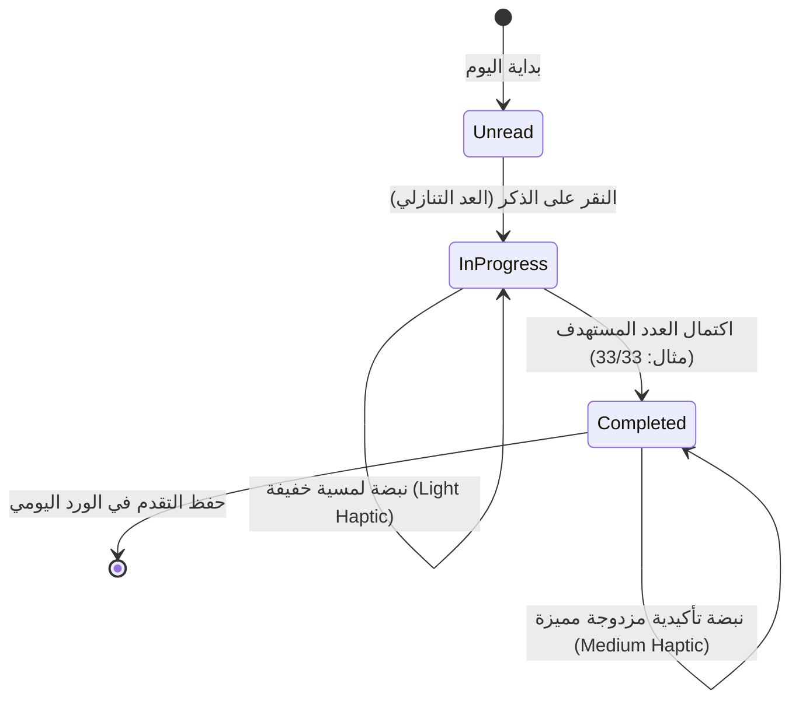
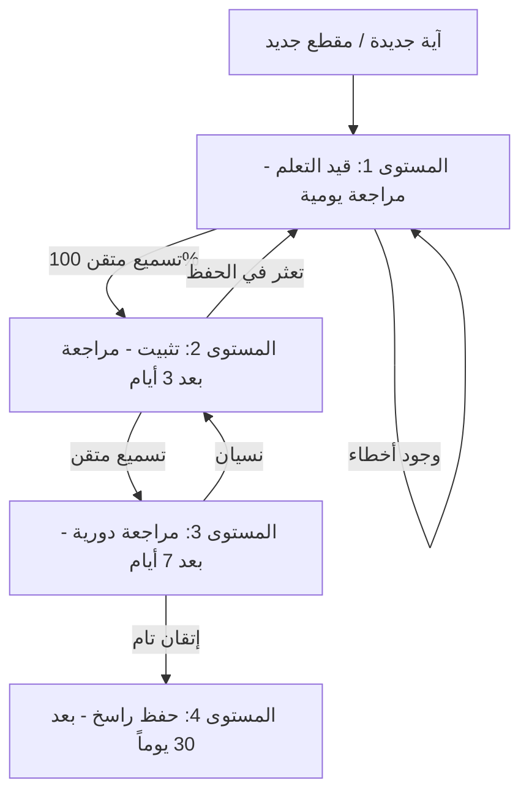
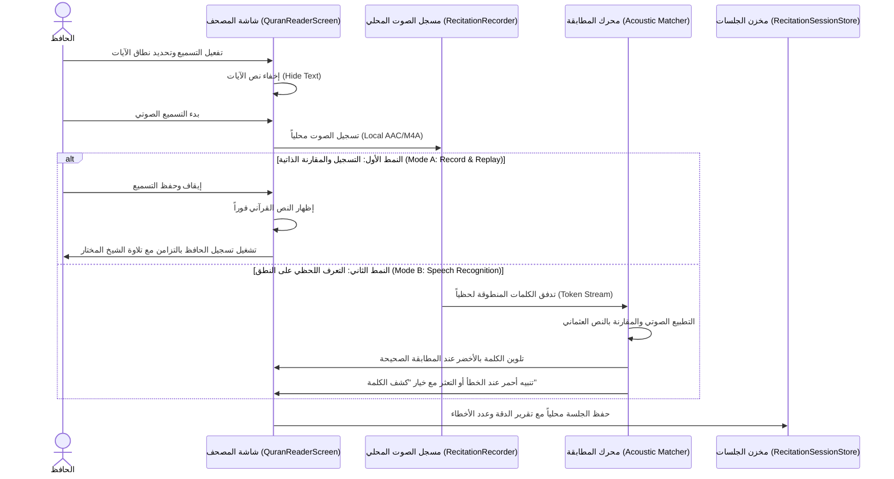

# 03 — منظومة الأذكار والتسميع والتحفيظ (Azkar, Recitation & Memorization)

تجمع هذه المنظومة في تطبيق **سِراج (SIRAJ)** بين ركنين أساسيين: **الأذكار والأدعية اليومية الصحيحة الموثقة من حصن المسلم**، و**استديو التحفيظ والتسميع الصوتي الذكي** القائم على خوارزميات التكرار المتباعد والتعرف اللحظي على الكلمات القرآنية محلياً.

---

## 📿 1. قاعدة بيانات حصن المسلم الموثقة (Authentic Adhkar Dataset)

تعتمد المنظومة على قاعدة بيانات موثقة ومحققة لأذكار وأدعية الكتاب والسنة المطهرة:
- **الموقع المصدري**: `lib/modules/adhkar/`
- **أهم الأبواب والتصنيفات**:
  1. **أذكار الصباح والمساء**: الأوراد اليومية مع فضل كل ذكر وعدد تكراره.
  2. **أذكار النوم والاستيقاظ**: أذكار الفراش، القلق والاضطراب في النوم، ورؤية الرؤيا.
  3. **أذكار الصلوات المفروضة**: أذكار ما بعد السلام، التسبيح، وأدعية صلاة الوتر والقنوت.
  4. **أدعية المسجد والوضوء والخلاء**: دعاء الذهاب للمسجد، الدخول والخروج، ودعاء الفراغ من الوضوء.
  5. **أدعية الأحوال والمناسبات**: الاستخارة، الكرب، السفر، المرض والرقية الشرعية، والأمطار والرياح.
- **التوثيق والتخريج الحديثي**:
  - يحتوي كل ذكر على النص العربي المشكول بدقة، الترجمة الصوتية والإنجليزية، درجة صحة الحديث، والمصدر الأصلي (صحيح البخاري، صحيح مسلم، سنن أبي داود، جامع الترمذي، ومسند أحمد).

---

## 📱 2. واجهة الأذكار التفاعلية والعدادات الذكية (Interactive Counter & Haptics)

### مزايا العداد الذكي:
- **التغذية اللمسية التفاعلية (Haptic Feedback)**:
  - نبضة خفيفة عند كل نقرة للعد دون الحاجة للنظر إلى الشاشة.
  - نبضة تأكيدية قوية واحتفالية بصرية ناعمة عند اكتمال تكرار الذكر والانتقال للذكر التالي تلقائياً.
- **حفظ ومتابعة التقدم (Daily Streak & Progress)**:
  - حفظ تقدم القراءة لحظياً عبر `KeyValueStore`.
  - شريط إنجاز يومي يوضح نسبة اكتمال أذكار الصباح وأذكار المساء.

---

## 🧠 3. محرك التحفيظ والتكرار المتباعد (Spaced Repetition Engine - SRS)

يعتمد نظام الحفظ في **سِراج** على خوارزمية ذكية مستوحاة من منحنى النسيان لإبنجهاوس (Ebbinghaus Forgetting Curve) لترسيخ الآيات في الذاكرة طويلة المدى:

### تصنيفات الحفظ والمراجعة:
1. **جديد (New)**: آيات مضافة لخطة الحفظ لم تبدأ مراجعتها بعد.
2. **قيد الحفظ (Learning)**: آيات تتم مراجعتها يومياً لترسيخ البدايات.
3. **قيد المراجعة (Reviewing)**: آيات تمت مراجعتها وتتم جدولتها كل عدة أيام.
4. **راسخ ومتقن (Mastered)**: آيات أتم الحافظ تسميعها دون أي خطأ لعدة دورات متتالية.

---

## 🎙️ 4. استديو التسميع الصوتي والتحقق اللحظي (In-Place Recitation Studio)

يتضمن تطبيق **سِراج** استديو تسميع مدمج مباشرة داخل شاشة المصحف الشريف (`QuranReaderScreen`) يتيح للحافظ التسميع واختبار حفظه بنمطين متقدمين:

### الخصائص الهندسية لاستديو التسميع:
1. **الخصوصية التامة 100%**: كافة التسجيلات الصوتية والتحليلات تتم **محلياً داخل الهاتف** ولا يتم رفع أي تسجيل لأي خادم سحابي خارجي.
2. **المطابقة الصوتية الذكية (Phonetic Normalization)**:
   - تسامح ذكي مع اختلافات همزات الوصل والقطع، وعلامات الوقف، مع التركيز على صحة الكلمات والترتيب الإعجازي للآيات.
3. **أزرار المساعدة الذكية**:
   - زر **«كشف الكلمة التالية»** لمساعدة الحافظ عند الاستعصاء دون إفساد الجلسة، مع احتسابها في تقرير المراجعة النهائي.
4. **سجل الجلسات (Recitation Session Store)**:
   - حفظ الجلسات المسجلة، مدة التسميع، عدد الكلمات الإجمالية، ونسبة الدقة لاستعراض التطور والتحسن في الحفظ بمرور الوقت.

