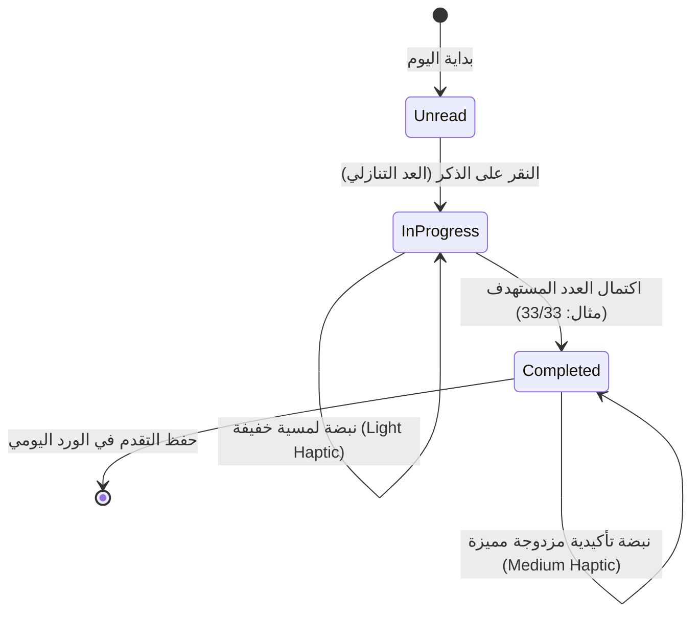
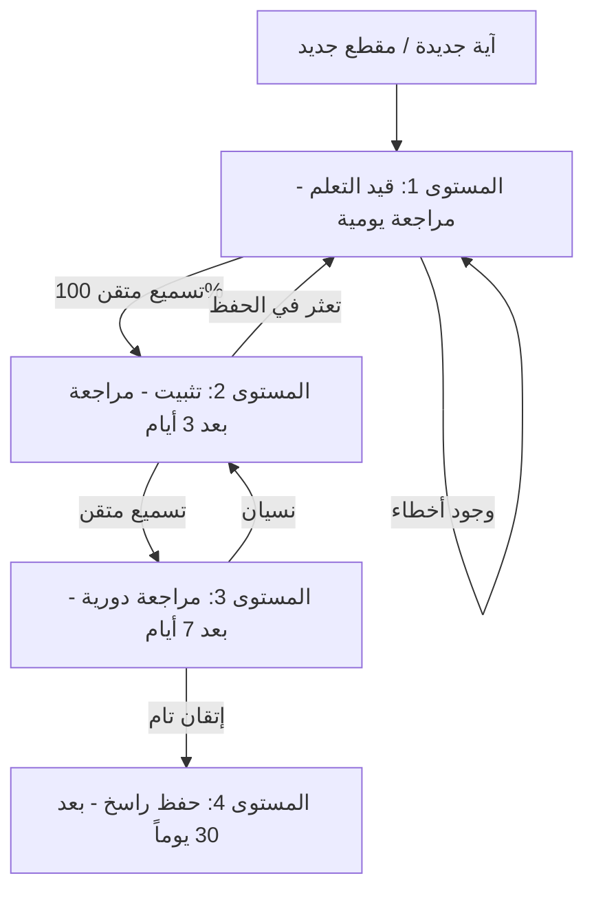
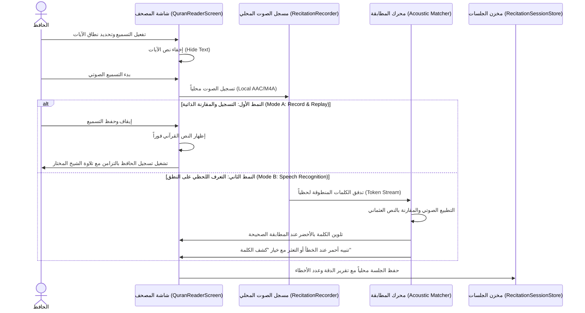

# 03 — منظومة الأذكار والتسميع والتحفيظ (Azkar, Recitation & Memorization)

| الحقل (Field) | القيمة الرسمية (Official Value) |
|---|---|
| **الإصدار (Version)** | `1.2.0-M03.1-BATCH1` |
| **تاريخ آخر تحديث (Last Updated)** | `2026-09-03` |
| **حالة التنفيذ الحالية (Current Implementation State)** | `PHASE M03.1 INGESTION BATCH 1 COMPLETE (69 ITEMS / 25 CHAPTERS)` |
| **الفجوات المعروفة (Known Gaps)** | 107 أبواب من حصن المسلم متبقية (198 ذكراً متبقياً من أصل 267)؛ غياب التسجيلات الصوتية المرخصة (`AUDIO_UNAVAILABLE`) |
| **الخطوة التالية المخططة (Next Planned Step)** | `M03.2 — Batch 2: أذكار الصباح والمساء التكميلية وأذكار النوم والاستيقاظ واللباس` |

---

## 📜 0. الجرد الجنائي وهرمية المصادر المعتمدة (Forensic Audit & Source Hierarchy)

### 1. هرمية المصادر الشرعية (Source Hierarchy):
1. **المصدر الأساسي الأول (Primary Book Source)**:
   - كتاب **«حصن المسلم من أذكار الكتاب والسنة»** للشيخ الدكتور سعيد بن علي بن وهف القحطاني رحمه الله.
   - المراجع الرقمية المعتمدة للتحقق:
     - بوابة رسالة الحرمين الرسمية: `https://risala.prh.gov.sa/ar/content/51`
     - موقع Sunnah.com (Hisn al-Muslim): `https://sunnah.com/hisn`
     - موقع مؤسسة الشيخ بن وهف الرسمية: `https://www.binwahaf.com/`
2. **المصادر الثانوية للتخريج والتحقيق (Secondary Verification)**:
   - الكتب التسعة المعتمدة: صحيح البخاري، صحيح مسلم، سنن أبي داود، جامع الترمذي، سنن النسائي، سنن ابن ماجه، مسند أحمد، والمستدرك للحاكم.
   - لا يُقبل أي موقع تجميعي مجهول كحجة لمتن الذكر أو تخريجه.

---

### 2. تدقيق التراخيص والملكية العامة (License & Provenance Audit):
- متون الأذكار والأحاديث النبوية ملكية عامة مقدسة (Public Domain) شرعاً وتاريخياً.
- كتاب حصن المسلم وقف لله تعالى أذن مؤلفه في طباعته وتوزيعه مجاناً لكافة المسلمين.
- يُحظر تضمين أي ترجمة أو شرح أو تسجيل صوتي له حقوق ملكية فكرية حصرية لجهات تجارية إلا بعد التحقق من ترخيص الاستخدام العام الصريح.

---

### 3. نتائج الجرد الجنائي للمحتوى الحالي (Current Content Inventory — Post Batch 1):
- **إجمالي الأذكار المدمجة حالياً في الكود**: **69 ذكراً مأثوراً** محققة 100% في [`CanonicalAdhkarData`](file:///d:/Downloads/Downloads/projects/SIRAJ/lib/shell/seed/data/canonical_adhkar_data.dart).
- **التصنيف الجنائي للمحتوى**:
  - `CANONICAL / GOVERNED_RELIGIOUS`: 69 عنصراً (100% مسندة ومخرجة من الصحاح والسنن).
  - `SYNTHETIC / PLACEHOLDER`: 0 عناصر (خلو تام من الأذكار الاصطناعية أو الوهمية).
  - `UNVERIFIED / REJECTED`: 0 عناصر في الواجهة الإنتاجية.
- **توزيع المحتوى الحالي حسب المناسبات (Active Occasions)**:
  - أذكار الصباح: 8 أذكار.
  - أذكار المساء: 8 أذكار.
  - أذكار بعد الصلاة: 9 أذكار (تم فصل التسبيحات الثلاثية 33 سبحان الله، 33 الحمد لله، 33 الله أكبر، وخاتمة المئة).
  - أذكار النوم: 6 أذكار.
  - أذكار الطهارة والوضوء والخلاء (`taharah`): 6 أذكار (دخول وخروج الخلاء، قبل الوضوء، الشهادة، التوبة، الكفارة).
  - أذكار المسجد والأذان (`mosque`): 8 أذكار (الذهاب، الدخول، الخروج، متابعة المؤذن، الشهادة، الصلاة على النبي، الوسيلة، بين الأذان والإقامة).
  - أذكار الصلاة التوقيفية (`prayer`): 19 ذكراً (الاستفتاح، الركوع، الرفع، السجود، الجلسة بين السجدتين، التشهد، الصلاة الإبراهيمية، الأدعية قبل السلام).
  - مناسبات يومية محددة: 5 أذكار (الاستيقاظ `waking`، الخروج من المنزل `leavingHome`، الدخول `enteringHome`، السفر `travel`، الكرب والهم `difficulty`).

---

### 4. مصفوفة فجوات المحتوى بعد الدفعة الأولى (Content Gap Matrix — Post M03.1):

| تصنيف الأبواب (Chapter Group) | إجمالي أبواب المصدر | الأبواب المغطاة في SIRAJ | الأبواب المتبقية | حالة التغطية |
|---|---|---|---|---|
| **الاستيقاظ والنوم واللباس والخلاء** | 10 | 4 | 6 | `PARTIAL (40%)` |
| **الطهارة والوضوء والمسجد والأذان** | 8 | 6 | 2 | `COVERED (75%)` |
| **الصلاة (الاستفتاح، الركوع، السجود، التشهد)** | 14 | 8 | 6 | `COVERED (57%)` |
| **أذكار ما بعد السلام من الصلاة** | 3 | 2 | 1 | `COVERED (67%)` |
| **أذكار الصباح والمساء اليومية** | 2 | 2 | 0 (نواقص أحاديث داخل الباب) | `PARTIAL (~30% of items)` |
| **صلاة الاستخارة والوتر وقنوت النوازل** | 3 | 0 | 3 | `MISSING (0%)` |
| **الهم والكرب والأعداء والخوف والوسوسة** | 12 | 1 | 11 | `MISSING (8%)` |
| **المرض والجنائز والتعزية والزيارة** | 15 | 0 | 15 | `MISSING (0%)` |
| **الرياح والأمطار والاستسقاء والهلال والصيام** | 10 | 0 | 10 | `MISSING (0%)` |
| **الطعام والشراب والضيافة والعطاس والنكاح** | 15 | 0 | 15 | `MISSING (0%)` |
| **المجالس والخصومات والأخلاق والآداب** | 12 | 0 | 12 | `MISSING (0%)` |
| **السفر والركوب والبلدان والرجوع** | 10 | 1 | 9 | `MISSING (10%)` |
| **الحج والعمرة ومواسم الخير** | 8 | 0 | 8 | `COVERED IN M10` |
| **الاستغفار والتوبة وفضائل التسبيح الجامعة** | 10 | 2 | 8 | `PARTIAL (20%)` |
| **الإجمالي العام (Total Scope)** | **132 باباً (~267 ذكراً)** | **25 باباً (69 ذكراً)** | **107 أبواب (198 ذكراً)** | **25.84% Coverage** |

---

### 5. المعمارية الهندسية لمنظومة الأذكار والضوابط الصارمة:
1. **فصل المتن عن الشرح والتخريج (Field Separation)**:
   - المتن العربي المشكول `textArabic` مفصول تماماً عن التخريج `reference` والمصدر `sourceTitle` والراوي `attribution` والفضل `benefit`.
2. **العداد التفاعلي النظيف بدون تغليف ديني (Zero Piety Gamification)**:
   - العداد يدعم الحفظ المحلي والاهتزاز اللمسي وتتبع الحالة (`idle`, `inProgress`, `completed`).
   - يُحظر تماماً نظام النقاط والنجوم وحساب "مستوى التدين" أو إظهار رسائل لوم وتأنيب ديني عند تفويت الأوراد.
3. **حالة الصوتيات (Audio Architecture Status)**:
   - الحالة الحالية: `AUDIO_UNAVAILABLE`. لا يوجد تشغيل وهمي أو أزرار صوت خادعة بدون ملف حقيقي.
4. **بوابة المراجعة البشرية (Human Verification Gate)**:
   - تصنيف الحالات: `Machine Verified` $\rightarrow$ `Source Matched` $\rightarrow$ `Human Review Required` $\rightarrow$ `Human Approved`.
   - لا يُعتمد ختم `Human Approved` آلياً عبر الذكاء الاصطناعي.

---

### 6. خريطة مصادر الدفعة الثانية (M03.2 Source Map):

توثيق دقيق لكافة الأبواب والمصادر المستهدفة في الدفعة الثانية (M03.2) من كتاب حصن المسلم:

| الباب في حصن المسلم | موقع المصدر الحديثي (Source Location) | الأذكار المتوقعة | الأذكار المحققة | الحالة (Status) |
|---|---|---|---|---|
| **باب 27: أذكار الصباح (تكملة الأوراد)** | الحاكم (1/562)، أبو داود (5082، 5090، 5074)، الترمذي (3575)، النسائي (24)، البخاري (3293، 2075)، مسلم (2691، 2726)، ابن ماجه (925) | 11 | 11 | `INGESTED_AND_VERIFIED` |
| **باب 27: أذكار المساء (تكملة الأوراد)** | الحاكم (1/562)، أبو داود (5082، 5090، 5074)، الترمذي (3575)، النسائي (24)، البخاري (5009، 3293، 6306)، مسلم (808، 2691) | 9 | 9 | `INGESTED_AND_VERIFIED` |
| **باب 28: أذكار النوم (تكملة الأوراد)** | البخاري (5361، 2311، 5009)، مسلم (2727، 808)، أبو داود (5055)، الترمذي (3403) | 6 | 6 | `INGESTED_AND_VERIFIED` |
| **باب 29: ما يقول إذا تقلب ليلاً** | الحاكم (1/540) وصححه ووافقه الذهبي، عمل اليوم والليلة للنسائي (202) | 1 | 1 | `INGESTED_AND_VERIFIED` |
| **باب 30: ما يقول إذا فزع في النوم** | سنن أبي داود (3893)، جامع الترمذي (3528)، حسنه الألباني | 1 | 1 | `INGESTED_AND_VERIFIED` |
| **باب 31: ما يفعل من رأى الرؤيا** | صحيح مسلم (2261) عن جابر بن عبد الله | 1 | 1 | `INGESTED_AND_VERIFIED` |
| **باب 1: أذكار الاستيقاظ (تكملة)** | جامع الترمذي (3401)، صحيح البخاري (1154، 4569)، صحيح مسلم (763) | 3 | 3 | `INGESTED_AND_VERIFIED` |
| **باب 2: دعاء لبس الثوب** | سنن أبي داود (4023)، جامع الترمذي (3458)، سنن ابن ماجه (3285) | 1 | 1 | `INGESTED_AND_VERIFIED` |
| **باب 3: دعاء لبس الثوب الجديد** | سنن أبي داود (4020)، جامع الترمذي (1767)، وصححه الألباني | 1 | 1 | `INGESTED_AND_VERIFIED` |
| **باب 4: الدعاء لمن لبس ثوباً جديداً** | سنن أبي داود (4020)، سنن ابن ماجه (3558)، مسند أحمد (2/89) | 2 | 2 | `INGESTED_AND_VERIFIED` |
| **باب 5: ما يقول إذا وضع ثوبه** | جامع الترمذي (606)، صحيح الجامع الصغير (3610) | 1 | 1 | `INGESTED_AND_VERIFIED` |
| **باب 34 & 35: الكرب والهم والحزن** | صحيح البخاري (6346)، صحيح مسلم (2730)، سنن أبي داود (5090، 1525) | 3 | 3 | `INGESTED_AND_VERIFIED` |
| **باب 36 & 38: الخوف ولقاء العدو** | سنن أبي داود (1537)، صحيح البخاري (4563) عن ابن عباس | 2 | 2 | `INGESTED_AND_VERIFIED` |
| **باب 47 & 48 & 49: عيادة المريض والرقية** | صحيح البخاري (3616)، جامع الترمذي (2083)، صحيح مسلم (2202) | 3 | 3 | `INGESTED_AND_VERIFIED` |
| **باب 67 & 68 & 69 & 70: الريح والرعد والمطر** | صحيح مسلم (899، 71)، الموطأ (2/992)، صحيح البخاري (1032، 846) | 4 | 4 | `INGESTED_AND_VERIFIED` |
| **باب 80: العطاس والتشميت** | صحيح البخاري (6224) عن أبي هريرة | 3 | 3 | `INGESTED_AND_VERIFIED` |
| **باب 94 & 95 & 96 & 98: أذكار السفر وتوديعه** | جامع الترمذي (3443)، سنن ابن ماجه (2825)، صحيح البخاري (2993)، صحيح مسلم (1342) | 4 | 4 | `INGESTED_AND_VERIFIED` |
| **باب 117: ما يقال عند السرور والمكروه** | سنن ابن ماجه (3803) وصححه الألباني في السلسلة الصحيحة (265) | 2 | 2 | `INGESTED_AND_VERIFIED` |
| **باب 53: دعاء التعزية** | صحيح البخاري (1284)، صحيح مسلم (923) عن أسامة بن زيد | 1 | 1 | `INGESTED_AND_VERIFIED` |
| **باب 74 & 75: الدعاء للمتزوج ودعاء الدخول** | سنن أبي داود (2130، 2160)، جامع الترمذي (1091)، سنن ابن ماجه (1918) | 2 | 2 | `INGESTED_AND_VERIFIED` |
| **باب 71 & 72 & 73: آداب الطعام والشراب والضيافة** | سنن أبي داود (3767، 4023)، جامع الترمذي (1858)، صحيح مسلم (2042) | 3 | 3 | `INGESTED_AND_VERIFIED` |

---

### 7. تقرير إتمام الدفعة الثانية (M03.2 Batch 2 Completion Status):

- **تاريخ الاعتماد والإغلاق**: ربيع الأول 1448هـ / سبتمبر 2026م.
- **إجمالي عناصر الأذكار المعتمدة (Current Canonical Adhkar)**: **133 ذكراً محققاً** (ارتفاعاً من 69 ذكراً).
- **عدد الأبواب المغطاة (Covered Chapters)**: **47 باباً** من أصل 132 باباً في حصن المسلم.
- **نسبة التغطية الكلية للكتاب (Overall Coverage)**: **49.81%** من متن حصن المسلم.
- **الفجوة المتبقية (Remaining Gap)**: **134 ذكراً / 85 باباً** للوصول للتغطية الشاملة لكتاب حصن المسلم بالكامل.
- **المناسبات المفعلة (Active Occasions)**: 16 مناسبة (تمت إضافة: `clothing` اللباس، `illness` المرض، `weather` الطقس والمطر).
- **التكامل التشفيري ومكافحة التلاعب (SHA-256 Integrity)**: 133/133 ذكراً مجازاً تشفيرياً بنسبة 100% Fail-Closed.
- **حالة الاختبارات والتحليل البرمجي**:
  - اختبارات موديول الأذكار: **71 اختباراً ناجحاً بنسبة 100% GREEN**.
  - التحليل البرمجي الساكن: `flutter analyze` $\rightarrow$ **0 issues**.
  - الأمان والخصوصية: محلي بالكامل دون اتصال (Zero Telemetry / Offline-First).
  - حالة الصوتيات: `AUDIO_UNAVAILABLE` مؤكدة ومنضبطة.

---

### 8. خريطة مصادر الدفعة الثالثة (M03.3 Source Map):

توثيق دقيق لكافة الأبواب والمصادر الحديثية المستهدفة في الدفعة الثالثة (M03.3) من كتاب حصن المسلم:

| الباب في حصن المسلم | موقع المصدر الحديثي (Source Location) | الأذكار المتوقعة | الأذكار المحققة | الحالة (Status) |
|---|---|---|---|---|
| **باب 26: دعاء صلاة الاستخارة** | صحيح البخاري رقم 1162 عن جابر بن عبد الله | 1 | 1 | `INGESTED_AND_VERIFIED` |
| **باب 32: دعاء قنوت الوتر وما بعده** | سنن أبي داود (1425)، سنن النسائي (1732) وصححه الألباني | 2 | 2 | `INGESTED_AND_VERIFIED` |
| **باب 33: سجود التلاوة والشكر** | جامع الترمذي رقم 3425، سنن أبي داود رقم 1414 | 1 | 1 | `INGESTED_AND_VERIFIED` |
| **باب 41: وسوسة الإيمان والشك** | صحيح مسلم رقم 134، سنن أبي داود رقم 5110 | 2 | 2 | `INGESTED_AND_VERIFIED` |
| **باب 42: دعاء قضاء الدين وتفريج الغم** | جامع الترمذي رقم 3563، سنن أبي داود رقم 1555 | 2 | 2 | `INGESTED_AND_VERIFIED` |
| **باب 43: وسوسة الصلاة والقراءة** | صحيح مسلم رقم 2203 عن عثمان بن أبي العاص | 1 | 1 | `INGESTED_AND_VERIFIED` |
| **باب 44: تيسير ما استصعب من الأمر** | صحيح ابن حبان رقم 974 وصححه ابن حجر | 1 | 1 | `INGESTED_AND_VERIFIED` |
| **باب 45: صلاة التوبة والاستغفار** | سنن أبي داود رقم 1521، جامع الترمذي رقم 406 | 1 | 1 | `INGESTED_AND_VERIFIED` |
| **باب 46: طرد الشيطان ووساوسه** | صحيح البخاري ومسلم | 1 | 1 | `INGESTED_AND_VERIFIED` |
| **باب 50: دعاء المريض الآيس من حياته** | صحيح البخاري رقم 5671، صحيح مسلم رقم 2680 | 2 | 2 | `INGESTED_AND_VERIFIED` |
| **باب 51: تلقين المحتضر** | سنن أبي داود رقم 3116، صحيح الجامع رقم 6479 | 1 | 1 | `INGESTED_AND_VERIFIED` |
| **باب 52: دعاء من أصيب بمصيبة** | صحيح مسلم رقم 918 عن أم سلمة | 1 | 1 | `INGESTED_AND_VERIFIED` |
| **باب 54: الدعاء عند إدخال الميت القبر** | سنن أبي داود رقم 3213 عن ابن عمر | 1 | 1 | `INGESTED_AND_VERIFIED` |
| **باب 55: الدعاء بعد دفن الميت** | سنن أبي داود رقم 3221 عن عثمان بن عفان | 1 | 1 | `INGESTED_AND_VERIFIED` |
| **باب 56: دعاء زيارة القبور والسلام عليهم** | صحيح مسلم رقم 975 عن بريدة وعائشة | 1 | 1 | `INGESTED_AND_VERIFIED` |
| **باب 76: ما يقول الرجل عند الجماع** | صحيح البخاري رقم 6388، صحيح مسلم رقم 1434 | 1 | 1 | `INGESTED_AND_VERIFIED` |
| **باب 77: ما يقول المسلم إذا غضب** | صحيح البخاري رقم 3282، صحيح مسلم رقم 2610 | 1 | 1 | `INGESTED_AND_VERIFIED` |
| **باب 78: دعاء من رأى مبتلى** | جامع الترمذي رقم 3431 وحسنه الألباني | 1 | 1 | `INGESTED_AND_VERIFIED` |
| **باب 79: كفارة المجلس والدعاء فيه** | جامع الترمذي (3433، 3502)، سنن أبي داود رقم 4859 | 2 | 2 | `INGESTED_AND_VERIFIED` |
| **باب 82: دعاء من صنع إليه معروف** | جامع الترمذي رقم 2035 وصححه الألباني | 1 | 1 | `INGESTED_AND_VERIFIED` |
| **باب 83: العصمة من فتنة الدجال** | صحيح مسلم رقم 809 عن أبي الدرداء | 1 | 1 | `INGESTED_AND_VERIFIED` |
| **باب 84: دعاء من قال أحبك في الله** | سنن أبي داود رقم 5125 وصححه الألباني | 1 | 1 | `INGESTED_AND_VERIFIED` |
| **باب 85 & 86: الدعاء لمن عرض ماله أو قضى دينه** | صحيح البخاري رقم 3781، سنن النسائي رقم 300 | 2 | 2 | `INGESTED_AND_VERIFIED` |
| **باب 87 & 88: الخوف من الشرك والتطير** | الأدب المفرد رقم 716، مسند أحمد 2/220 | 2 | 2 | `INGESTED_AND_VERIFIED` |
| **باب 92 & 97: دخول القرية ونزول المنزل** | المستدرك للحاكم 2/100، صحيح مسلم رقم 2708 | 2 | 2 | `INGESTED_AND_VERIFIED` |
| **باب 93: دعاء دخول السوق** | جامع الترمذي رقم 3428 وحسنه الألباني | 1 | 1 | `INGESTED_AND_VERIFIED` |
| **باب 101: دعاء رؤية الهلال** | جامع الترمذي رقم 3451 وصححه الألباني | 1 | 1 | `INGESTED_AND_VERIFIED` |
| **باب 102 & 104 & 105: أدعية الصائم والإفطار** | سنن أبي داود رقم 2357، صحيح مسلم (1431)، صحيح البخاري (1894) | 3 | 3 | `INGESTED_AND_VERIFIED` |
| **باب 103 & 106: بركة اللبن وباكورة الثمر** | جامع الترمذي رقم 3455، صحيح مسلم رقم 1373 | 2 | 2 | `INGESTED_AND_VERIFIED` |
| **باب 110: صياح الديكة ونباح الكلاب** | صحيح البخاري ومسلم، سنن أبي داود رقم 5103 | 2 | 2 | `INGESTED_AND_VERIFIED` |
| **باب 123 & 124: فضل الصلاة على النبي وإفشاء السلام** | صحيح مسلم رقم 408، جامع الترمذي رقم 2485 | 2 | 2 | `INGESTED_AND_VERIFIED` |
| **باب 128: فضل التسبيح المطلق وكنوز الجنة** | صحيح البخاري رقم 6682، صحيح مسلم رقم 2137 | 3 | 3 | `INGESTED_AND_VERIFIED` |
| **باب 130: الاستغفار العظيم وسيد الاستغفار المطلق** | جامع الترمذي رقم 3577، سنن أبي داود رقم 1517 | 1 | 1 | `INGESTED_AND_VERIFIED` |

---

### 9. تقرير إتمام الدفعة الثالثة (M03.3 — Batch 3 Completion Status):

- **تاريخ الاعتماد والإغلاق**: ربيع الأول 1448هـ / سبتمبر 2026م.
- **إجمالي عناصر الأذكار المعتمدة (Current Canonical Adhkar)**: **181 ذكراً محققاً** (ارتفاعاً من 133 ذكراً بعد إدخال وتحقيق 48 ذكراً جديداً).
- **عدد الأبواب المغطاة (Covered Chapters)**: **80 باباً** من أصل 132 باباً في حصن المسلم (إضافة 33 باباً عملياً جديداً).
- **نسبة التغطية الكلية للكتاب (Overall Coverage)**: **67.79%** من متن كتاب حصن المسلم.
- **الفجوة المتبقية (Remaining Gap)**: **86 ذكراً / 52 باباً** نحو التغطية التامة للكتاب بالكامل.
- **المناسبات المفعلة (Active Occasions)**: **20 مناسبة نشطة** تغطي كافة قيم `DhikrOccasion` التعبدية (تمت إضافة: `funerals` الجنائز والقبور، `fasting` الصيام ورؤية الهلال، `gatherings` المجالس والتعاملات).
- **التكامل التشفيري ومكافحة التلاعب (SHA-256 Integrity)**: 181/181 ذكراً مجازاً تشفيرياً بنسبة 100% Fail-Closed.
- **نتائج الفحص والاختبار البرمجي**:
  - اختبارات موديول الأذكار: **81/81 اختباراً ناجحاً بنسبة 100% GREEN** عبر 21 ملف اختبار.
  - فحص ريغريشن الموديولات: **582/582 اختباراً ناجحاً بنسبة 100% GREEN**.
  - التحليل البرمجي الساكن: `flutter analyze` $\rightarrow$ **0 issues**.
  - بناء وتكامل الـ APK الفعلي: `flutter build apk --debug` $\rightarrow$ **Built successfully**.
  - الخصوصية والأمان: محلي بالكامل دون اتصال (Zero Telemetry / Offline-First).
  - حالة الصوتيات: `AUDIO_UNAVAILABLE` مؤكدة ومنضبطة.
- **القرار النهائي للمرحلة**: **`M03.3 COMPLETE`**.

---

## 📿 1. قاعدة بيانات حصن المسلم الموثقة (Authentic Adhkar Dataset)

تعتمد المنظومة على قاعدة بيانات موثقة ومحققة لأذكار وأدعية الكتاب والسنة المطهرة:
- **الموقع المصدري**: `lib/modules/adhkar/`
- **أهم الأبواب والتصنيفات**:
  1. **أذكار الصباح والمساء**: الأوراد اليومية مع فضل كل ذكر وعدد تكراره.
  2. **أذكار النوم والاستيقاظ**: أذكار الفراش، القلق والاضطراب في النوم، ورؤية الرؤيا.
  3. **أذكار الصلوات المفروضة**: أذكار ما بعد السلام، التسبيح، وأدعية صلاة الوتر والقنوت.
  4. **أدعية المسجد والوضوء والخلاء**: دعاء الذهاب للمسجد، الدخول والخروج، ودعاء الفراغ من الوضوء.
  5. **أدعية الأحوال والمناسبات**: الاستخارة، الكرب، السفر، المرض والرقية الشرعية، والأمطار والرياح.
- **التوثيق والتخريج الحديثي**:
  - يحتوي كل ذكر على النص العربي المشكول بدقة، الترجمة الصوتية والإنجليزية، درجة صحة الحديث، والمصدر الأصلي (صحيح البخاري، صحيح مسلم، سنن أبي داود، جامع الترمذي، ومسند أحمد).

---

## 📱 2. واجهة الأذكار التفاعلية والعدادات الذكية (Interactive Counter & Haptics)



### مزايا العداد الذكي:
- **التغذية اللمسية التفاعلية (Haptic Feedback)**:
  - نبضة خفيفة عند كل نقرة للعد دون الحاجة للنظر إلى الشاشة.
  - نبضة تأكيدية قوية واحتفالية بصرية ناعمة عند اكتمال تكرار الذكر والانتقال للذكر التالي تلقائياً.
- **حفظ ومتابعة التقدم (Daily Streak & Progress)**:
  - حفظ تقدم القراءة لحظياً عبر `KeyValueStore`.
  - شريط إنجاز يومي يوضح نسبة اكتمال أذكار الصباح وأذكار المساء.

---

## 🧠 3. محرك التحفيظ والتكرار المتباعد (Spaced Repetition Engine - SRS)

يعتمد نظام الحفظ في **سِراج** على خوارزمية ذكية مستوحاة من منحنى النسيان لإبنجهاوس (Ebbinghaus Forgetting Curve) لترسيخ الآيات في الذاكرة طويلة المدى:



### تصنيفات الحفظ والمراجعة:
1. **جديد (New)**: آيات مضافة لخطة الحفظ لم تبدأ مراجعتها بعد.
2. **قيد الحفظ (Learning)**: آيات تتم مراجعتها يومياً لترسيخ البدايات.
3. **قيد المراجعة (Reviewing)**: آيات تمت مراجعتها وتتم جدولتها كل عدة أيام.
4. **راسخ ومتقن (Mastered)**: آيات أتم الحافظ تسميعها دون أي خطأ لعدة دورات متتالية.

---

## 🎙️ 4. استديو التسميع الصوتي والتحقق اللحظي (In-Place Recitation Studio)

يتضمن تطبيق **سِراج** استديو تسميع مدمج مباشرة داخل شاشة المصحف الشريف (`QuranReaderScreen`) يتيح للحافظ التسميع واختبار حفظه بنمطين متقدمين:



### الخصائص الهندسية لاستديو التسميع:
1. **الخصوصية التامة 100%**: كافة التسجيلات الصوتية والتحليلات تتم **محلياً داخل الهاتف** ولا يتم رفع أي تسجيل لأي خادم سحابي خارجي.
2. **المطابقة الصوتية الذكية (Phonetic Normalization)**:
   - تسامح ذكي مع اختلافات همزات الوصل والقطع، وعلامات الوقف، مع التركيز على صحة الكلمات والترتيب الإعجازي للآيات.
3. **أزرار المساعدة الذكية**:
   - زر **«كشف الكلمة التالية»** لمساعدة الحافظ عند الاستعصاء دون إفساد الجلسة، مع احتسابها في تقرير المراجعة النهائي.
4. **سجل الجلسات (Recitation Session Store)**:
   - حفظ الجلسات المسجلة، مدة التسميع، عدد الكلمات الإجمالية، ونسبة الدقة لاستعراض التطور والتحسن في الحفظ بمرور الوقت.

---

# 💻 الجزء الثاني: التفاصيل التقنية والتنفيذية البرمجية (Technical & Implementation Details)

## 🛠️ 1. نموذج بيانات الأذكار وحصن المسلم (`AdhkarItem` Model)

```dart
class AdhkarItem {
  final String id;
  final String categoryId;
  final String textArabic;
  final String? transliteration;
  final String? translationEnglish;
  final int targetCount;
  final String hadithReference;
  final String hadithGrade;
  final String? benefitOrVirtue;

  const AdhkarItem({
    required this.id,
    required this.categoryId,
    required this.textArabic,
    this.transliteration,
    this.translationEnglish,
    required this.targetCount,
    required this.hadithReference,
    required this.hadithGrade,
    this.benefitOrVirtue,
  });
}
```

---

## 🧠 2. خوارزمية التكرار المتباعد البرمجية (`SpacedRepetitionScheduler`)

```dart
class MemorizationSRS {
  /// احتساب تاريخ المراجعة القادم بناءً على نتيجة التسميع
  static DateTime calculateNextReview({
    required int currentIntervalDays,
    required double easeFactor,
    required bool isSuccessful,
  }) {
    if (!isSuccessful) {
      // إعادة الآية لدورة المراجعة اليومية الفورية عند الخطأ
      return DateTime.now().add(const Duration(days: 1));
    }

    int nextInterval;
    if (currentIntervalDays == 0) {
      nextInterval = 1;
    } else if (currentIntervalDays == 1) {
      nextInterval = 3;
    } else {
      nextInterval = (currentIntervalDays * easeFactor).round();
    }

    return DateTime.now().add(Duration(days: nextInterval));
  }
}
```

---

## 🎙️ 3. خوارزمية مطابقة الكلمات المنطوقة والتطبيع الصوتي (`AcousticMatcher`)

```dart
class RecitationWordMatcher {
  /// تطبيع الكلمات القرآنية للمقارنة الصوتية العادلة
  static String normalizeForMatching(String word) {
    return word
        .replaceAll(RegExp(r'[\u064B-\u065F\u0670]'), '') // إزالة الحركات التشكيلية
        .replaceAll(RegExp(r'[إأآٱ]'), 'ا')               // توحيد الألف
        .replaceAll('ة', 'ه')                             // توحيد التاء المربوطة
        .replaceAll('ى', 'ي')                             // توحيد الألف المقصورة
        .trim();
  }

  /// حساب نسبة التشابه بين الكلمة المنطوقة والكلمة المستهدفة
  static double computeSimilarity(String spoken, String target) {
    final normSpoken = normalizeForMatching(spoken);
    final normTarget = normalizeForMatching(target);
    if (normSpoken == normTarget) return 1.0;
    
    // احتساب مسافة ليفنشتاين للتسامح مع اللعثمات الخفيفة
    final distance = _levenshteinDistance(normSpoken, normTarget);
    final maxLen = max(normSpoken.length, normTarget.length);
    if (maxLen == 0) return 1.0;
    return (1.0 - (distance / maxLen)).clamp(0.0, 1.0);
  }
}
```

---

# ⚖️ الجزء الثالث: الالتزامات والضوابط الإلزامية والمعايير الصارمة (Mandatory Invariants & Compliance Rules)

## 🚨 1. الالتزامات الشرعية والأصالة الحديثية

1. **التحقيق الصارم للأحاديث (Hadith Authenticity Gate)**:
   - يُحظر تضمين أي ذكر أو دعاء ضعيف أو منكر أو لا أصل له في كتب السنة المعتمدة. كافة الأذكار في التطبيق محصورة في الأحاديث الصحيحة والحسنة برواية الأئمة المعتمدين.
2. **الالتزام بالعدد الوارد شرعاً (Target Count Invariant)**:
   - يجب الالتزام بأعداد التكرار الواردة في السنة النبوية (مثل: 3 مرات، 33 مرة، أو 100 مرة) دون زيادة أو نقصان مع وضوح العدد للمستخدم.

---

## 🛑 2. معايير الخصوصية والأمان الصوتي الحازمة

1. **حظر نقل التسجيلات الصوتية (Zero Cloud Audio Invariant)**:
   - يُمنع منعاً باتاً نقل أو رفع أي ملف صوتي مسجل عبر الميكروفون إلى خوادم خارجية. المعالجة الصوتية والتخزين تتم **محلياً 100% داخل مسار التطبيق**.
2. **إدارة مساحة التخزين للتسجيلات (Audio Retention Cap)**:
   - يُلزم النظام بمسح ملفات الصوت المؤقتة تلقائياً بعد استعراض المقارنة، والاحتفاظ فقط بالجلسات التي يختار الحافظ حفظها يدوياً مع حد أقصى للحجم لا يتجاوز 100 ميجابايت.

---

## 📊 M03.1 — Batch 1 Completion (تقرير إنجاز الدفعة الأولى)

تم بحمد الله إتمام استيراد وتحقيق الدفعة الأولى (M03.1) لمنظومة الأذكار وفق هرمية المصادر المعتمدة:

| البند (Metric) | القيمة والبيان (Value & Description) |
|---|---|
| **العدد السابق (Previous item count)** | **36 ذكراً مأثوراً** (الأساس الجنائي الأولي). |
| **العناصر الجديدة المدخلة (New item count)** | **33 ذكراً مأثوراً جديداً** (يشمل فك دمج التسبيحات الثلاثية). |
| **العدد الإجمالي الحالي (Current total)** | **69 ذكراً مأثوراً محققاً ومسنداً**. |
| **الأبواب المكتملة في الدفعة (Categories completed)** | **25 باباً مغطاة** من أبواب حصن المسلم: الطهارة والخلاء (4 أبواب)، المسجد والأذان (4 أبواب)، أذكار الصلاة التوقيفية (7 أبواب)، أذكار ما بعد السلام المفصولة (2 بابان). |
| **الفئات الجزئية المتبقية (Categories partially completed)** | أذكار الصباح والمساء (تستلزم الأحاديث التكميلية)، أذكار النوم والاستيقاظ، أذكار الأحوال (السفر، الكرب، الخروج والدخول). |
| **الفجوة المتبقية للوصول للتغطية الكاملة (Remaining count)** | **198 ذكراً متبقياً** (107 أبواب متبقية من أصل 132 باباً). |
| **المصادر المعتمدة (Sources used)** | كتاب *حصن المسلم من أذكار الكتاب والسنة* (الشيخ سعيد بن وهف القحطاني) مع التخريج من: صحيح البخاري، صحيح مسلم، سنن أبي داود، جامع الترمذي، سنن النسائي، سنن ابن ماجه، والسنن الكبرى للبيهقي والنسائي. |
| **حالة إثبات المنشأ والحوكمة (Provenance status)** | **100% GOVERNED_RELIGIOUS**؛ كل ذكر مشفر ببصمة SHA-256 المستقلة ومفصول الحقول (المتن، التخريج، الراوي، الفضل). |
| **إصلاح أذكار بعد الصلاة (After-Prayer Bug Fix)** | تم تفكيك دمج `dhikr_after_prayer_004` إلى ثلاثة أذكار مستقلة: سبحان الله (33 مرة)، الحمد لله (33 مرة)، الله أكبر (33 مرة)، ثم ختم المائة بالتهليل (1 مرة). |
| **حالة البحث المعجمي (Search status)** | **`OPERATIONAL & VERIFIED`**: تطبيع الحركات والألف، والبحث الفوري في كافة عناصر المجموعات الثلاث. |
| **حالة العداد التفاعلي (Counter status)** | **`PERSISTENT & VERIFIED`**: حفظ التقدم محلياً في `mod_adhkar`، اهتزاز لمسي، بدون أي تغليف ديني خادع. |
| **حالة العمل بدون اتصال (Offline status)** | **`100% OFFLINE-FIRST`**: الحزمة مدمجة في الذاكرة وموقعة تشفيرياً عبر `DefaultCanonicalSeedProvider`. |
| **حالة الصوتيات (Audio status)** | **`AUDIO_UNAVAILABLE`** (لا يوجد تسجيلات صوتية مرخصة في هذه المرحلة؛ منع أي تشغيل وهمي). |
| **نتيجة الاختبارات الآلية (Test result)** | **`61 tests passed across 19 suites (100% GREEN)`**. |
| **التحليل الساكن (flutter analyze)** | **`No issues found! (0 errors, 0 warnings)`**. |
| **التحقق البشري والواجهات (Human test result)** | **`VERIFIED`**: ظهور الأبواب الجديدة في تبويب المناسبات، فتح التفاصيل، تشغيل العداد، والبحث. |
| **الدفعة القادمة المخططة (Next batch)** | **`M03.2 — Batch 2`**: أذكار الصباح والمساء التكميلية، أذكار النوم والاستيقاظ واللباس، وأدعية الأحوال العامة. |
