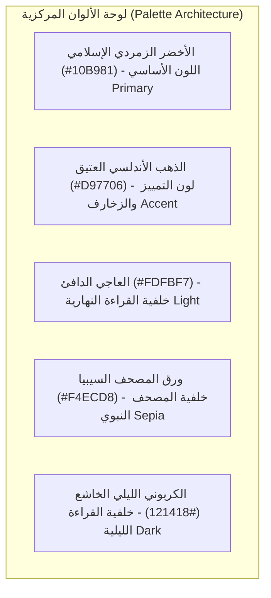
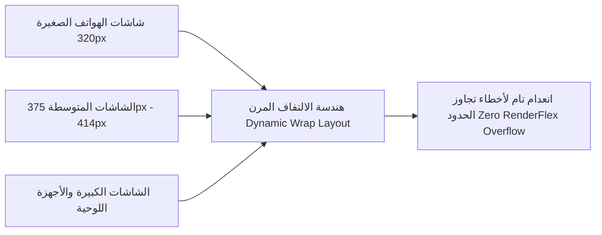
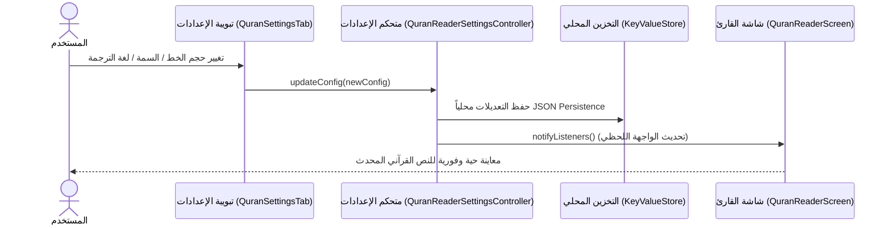

# 04 — واجهة المستخدم والسمات البصرية (UI Shell, Design System & Themes)

تُمثل واجهة مستخدم تطبيق **سِراج (SIRAJ)** نموذجاً هندسياً فريداً يجمع بين **الأصالة والسكينة والجماليات الإسلامية** من جهة، و**الأداء التفاعلي فائق النعومة والتجاوب الكامل مع كافة شاشات الهواتف** من جهة أخرى.

---

## 🎨 1. نظام التصميم الإسلامي ولوحة الألوان (Islamic Design System)

تم انتقاء الألوان والزخارف بعناية فائقة لتعزيز التركيز والخشوع أثناء قراءة القرآن وتأدية العبادات:

### رموز ودلالات الألوان:
1. **اللون الأساسي (`AppColors.primary` - `#10B981`)**: الزمردي الإسلامي يرمز للنماء والسكينة والحياة.
2. **لون التمييز (`AppColors.accent` - `#D97706`)**: الذهب المعتق يرمز لأصالة المخطوطات والزخارف القرآنية.
3. **ألوان النصوص والتباين**: الالتزام الصارم بمعايير الوصول العالمي (WCAG AAA) مع نسبة تباين تتجاوز `7:1` لضمان قراءة مريحة بدون أي إجهاد بصري.

---

## 🌓 2. السمات البصرية الثلاث المتكيفة (The 3 Visual Themes)

| السمة البصرية | لون الخلفية (HEX) | لون النص القرآني | الاستخدام والتجربة الشعورية |
| :--- | :--- | :--- | :--- |
| **1. السمة الفاتحة (Light Theme)** | `#FDFBF7` (عاجي دافئ) | أسود قرآني فاحم (`#1A1A1A`) | مخصصة للقراءة النهارية والبيئات المضيئة، تحافظ على طاقة العين وتمنع التوهج الأبيض المزعج. |
| **2. سمة ورق المصحف (Sepia Quran)** | `#F4ECD8` (ورق تراثي) | بني مصحفي داكن (`#2C1D11`) | تحاكي ملمس وصفحات المصحف الورقي الشريف ومصاحف المدينة القديمة مع إحساس مريح بالألفة والتراث. |
| **3. السمة الداكنة (Dark Night)** | `#121418` (كربوني عميق) | عاجي هادئ (`#E0E0E0`) | مخصصة لصلاة الليل والتهجد والقراءة في الظلام التام مع استهلاك طاقة شبه معدوم على شاشات OLED. |

---

## 📱 3. هندسة التجاوب والشاشات المرنة (Responsive Mobile Architecture)

صُممت كافة شاشات التطبيق لتتجاوب ديناميكياً مع قياسات الهواتف الذكية بجميع أبعادها (بدءاً من الشاشات الصغيرة جداً بعرض 320px، حتى الهواتف الكبيرة والشاشات القابلة للطي والأجهزة اللوحية):

### معايير التجاوب المطبقة:
1. **استبدال الصفوف الصلبة بالأعمدة المرنة والـ Wrap**:
   - استخدام `Wrap(spacing: 6, runSpacing: 6)` في أزرار سرعات التلاوة (`0.75x`, `1.0x`, `1.25x`, `1.5x`, `2.0x`) وخيارات ألوان السمة لضمان التفاف العناصر تلقائياً عند ضيق الشاشة.
2. **احتواء القوائم المنسدلة (Dropdown Expansion & Ellipsis)**:
   - ضبط خاصية `isExpanded: true` و `overflow: TextOverflow.ellipsis` في كافة القوائم المنسدلة (اختيار القراء، والترجمات) لتفادي دفع عناصر التحكم خارج الشاشة.
3. **التصميم العمودي لبطاقات التنزيل والاستيراد**:
   - ترتيب بطاقة استيراد حزم الـ ZIP وأزرار تحميل السور بشكل عمودي مرن يتكيف تلقائياً مع عرض شاشة الهاتف.

---

## 🎛️ 4. متحكم إعدادات المصحف والطباعة (Quran Reader Settings Controller)

- **المسار المصدري**: `lib/shell/quran/controllers/quran_reader_settings_controller.dart`
- **النموذج المعماري**:
  - متحكم أحادي المصدر للحقيقة (Single Source of Truth) يرث من `ChangeNotifier` ويعتمد على نموذج بيانات غير قابل للتعديل (`QuranTypographyConfig`).

### الخيارات القابلة للتخصيص الكامل:
- **حجم الخط القرآني**: شريط تمرير سلس من **18px** إلى **38px** مع شاشة معاينة حية وفورية لآية البسملة الشريفة.
- **تباعد الأسطر (Line Height)**: تعديل انسيابي من **1.8x** إلى **2.8x** لتوفير راحة بصرية فائقة أثناء القراءة المتصلة.
- **لغات الترجمة**: اختيار مباشر وفوري بين اللغات الـ 11 المعتمدة محلياً.
- **الفواصل المرجعية المدمجة**: استعراض كافة الآيات والسور المحفوظة بفواصل مرجعية مع إمكانية حذفها أو القفز المباشر إليها.

