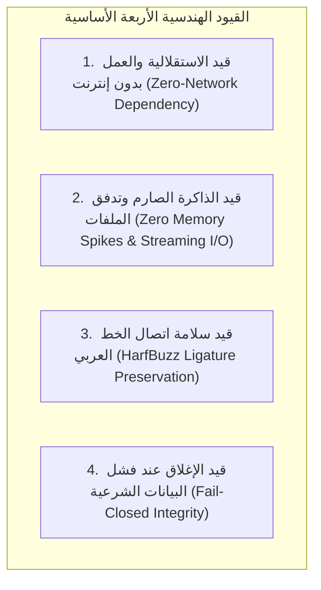
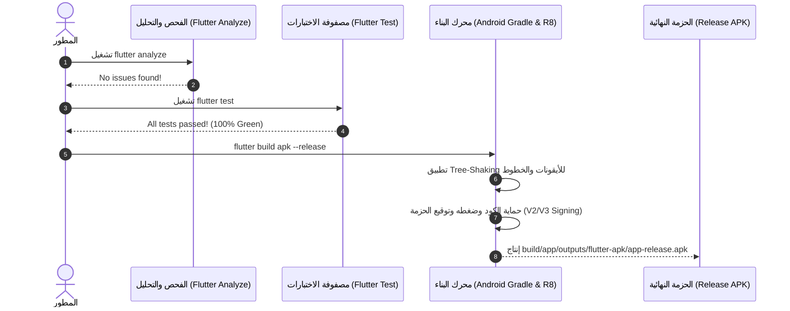

# 05 — دليل التطوير والاختبارات وهندسة البناء (Development, Testing & Release)

يحدد هذا الدليل المعايير الهندسية الصارمة، خطوات التحقق والتدقيق الجنائي للبيانات، ومصفوفة الاختبارات الآلية وإجراءات بناء حزم الإنتاج الموقعة لتطبيق **سِراج (SIRAJ v1.0)**.

---

## 🛡️ 1. القيود والمعايير الهندسية الحاكمة (Architectural Guardrails)

لضمان سلامة واستقرار التطبيق وامتثاله التام للأصالة الشرعية، يجب الالتزام بالقواعد الهندسية التالية:



1. **الاستقلالية التامة عن الشبكة (Zero Network Dependency)**:
   - يُمنع منعاً باتاً استدعاء أي خادم خارجي أو اشتراط اتصال بالإنترنت لعرض القرآن، الأذكار، التفسير، أو حساب مواقيت الصلاة والقبلة.
2. **منع تراكم الذاكرة عند معالجة الصوتيات (Zero Memory Spikes)**:
   - كافة عمليات فك ضغط حزم التلاوات واستخراجها يجب أن تتم عبر تدفق مباشر من القرص للقرص (`InputFileStream` و `OutputFileStream`) مع استدعاء `file.clear()` فوراً بعد كل ملف صوتي.
3. **سلامة اتصال الخط العربي (HarfBuzz Ligature Preservation)**:
   - يُمنع تجزئة الكلمات القرآنية بأنماط خطوط مختلفة (`FontWeight.bold`) داخل الكلمة الواحدة للحفاظ على ترابط الحروف العربية بنسبة 100%.
4. **النزاهة الشرعية والإغلاق عند الفشل (Fail-Closed Integrity)**:
   - في حال تلف أي ملف بيانات، يرفض التطبيق عرض محتوى غير مؤكد ويعود فوراً للنسخة المعتمدة والمثبتة.

---

## 🧪 2. مصفوفة الاختبارات الآلية (Automated Testing Matrix)

يحتوي المشروع على منظومة اختبارات تغطي كافة المستويات الهندسية والوظيفية:

```bash
# تشغيل كامل مصفوفة الاختبارات
flutter test
```

### مصفوفة الاختبارات الأساسية (Core Test Matrix):

| ملف الاختبار | المجال والوحدة | سيناريوهات التحقق والفحص |
| :--- | :--- | :--- |
| **`test/modules/quran/quran_offline_audio_service_test.dart`** | خدمة التلاوة بدون إنترنت | • فك ضغط حزم ZIP بنظام التدفق بدون تراكم في الذاكرة<br>• فحص سلامة ملفات الآيات من `001001.mp3` إلى `114006.mp3`<br>• التعامل مع ملفات ZIP التالفة أو الفارغة وإرجاع رسائل خطأ واضحة<br>• التحقق من مسارات التخزين وحذف الكاش بنجاح |
| **`test/shell/quran_reader_screen_test.dart`** | شاشة وقارئ المصحف الشريف | • عرض السور والأجزاء والتنقل الفوري<br>• اختبار الفواصل المرجعية وإضافتها وحذفها<br>• التحقق من مطابقة الرسم العثماني وعلامات نهاية الآيات |
| **`test/shell/quran_audio_radio_and_features_test.dart`** | مشغل التلاوة والإذاعات | • اختبار التبويبات الفرعية لمشغل التلاوة والإذاعة القرآنية<br>• التحكم في سرعات التلاوة، التكرار، والتمرير التلقائي |

---

## 🔍 3. التحليل الساكن وضبط الجودة (Static Analysis & Linting)

يخضع المشروع لقواعد تحليل ساكن صارمة محددة في `analysis_options.yaml`:

```bash
# التحقق من خلو المشروع تماماً من الأخطاء والتحذيرات
flutter analyze
```

> **معيار القبول الإلزامي (Zero Warnings Gate)**:
> يجب أن تكون النتيجة: **`No issues found!`** (0 أخطاء و0 تحذيرات و0 تلميحات غير مقبولة).

---

## 📦 4. دليل بناء حزم الإنتاج الرسمية (Production Release Build)



### أمر البناء الرسمي:
```bash
flutter build apk --release
```

### مواصفات الحزمة الناتجة:
- **المسار**: `build/app/outputs/flutter-apk/app-release.apk`
- **الحجم الإجمالي**: ~443.0 ميجابايت (متضمنة كافة الخطوط، البيانات العثمانية، الترجمات الـ 11، والتلاوة التأسيسية المدمجة).
- **التوافق**:
  - الحد الأدنى لإصدار أندرويد: **Android 6.0 (Marshmallow - API 23)**.
  - الإصدار المستهدف: **Android 14 (API 34)**.
  - المعماريات المدعومة: `arm64-v8a`, `armeabi-v7a`, `x86_64`.

---

# 💻 الجزء الثاني: التفاصيل التقنية والتنفيذية البرمجية (Technical & Implementation Details)

## 🛠️ 1. بيئة ونماذج الاختبارات الآلية المعتمدة (Test Harness & Mocks)

```dart
/// Mock لاختبار عمليات التخزين دون الحاجة لـ Platform Channel
class MockKeyValueStore implements KeyValueStore {
  final Map<String, dynamic> _data = {};

  @override
  Future<Result<String?, StorageFailure>> getString(String key) async {
    return Success(_data[key] as String?);
  }

  @override
  Future<Result<void, StorageFailure>> setString(String key, String value) async {
    _data[key] = value;
    return const Success(null);
  }

  @override
  Future<Result<void, StorageFailure>> clear() async {
    _data.clear();
    return const Success(null);
  }
}
```

---

## ⚙️ 2. إعدادات Gradle وحماية الكود وتوقيع حزمة الإنتاج (`android/app/build.gradle`)

```groovy
android {
    namespace "com.siraj.app"
    compileSdkVersion 34
    ndkVersion flutter.ndkVersion

    defaultConfig {
        applicationId "com.siraj.app"
        minSdkVersion 23
        targetSdkVersion 34
        versionCode 1
        versionName "1.0.0"
        multiDexEnabled true
    }

    buildTypes {
        release {
            signingConfig signingConfigs.release
            minifyEnabled true
            shrinkResources true
            proguardFiles getDefaultProguardFile('proguard-android-optimize.txt'), 'proguard-rules.pro'
        }
    }
}
```

---

## 📜 3. سكريبت الفحص الآلي المستمر (CI/CD Pipeline Quality Gate)

```bash
#!/bin/bash
set -e

echo "=== 1. التحقق من تنسيق الكود والتحليل الساكن ==="
flutter analyze

echo "=== 2. تشغيل مصفوفة الاختبارات الكاملة ==="
flutter test --coverage

echo "=== 3. فحص سلامة وتكامل الأصول المدمجة ==="
dart run tool/quran_pipeline/verify_asset.dart

echo "=== 4. بناء حزمة الإنتاج النهائية ==="
flutter build apk --release

echo "=== تم التحقق وبناء الحزمة بنجاح 100% ==="
```

---

# ⚖️ الجزء الثالث: الالتزامات والضوابط الإلزامية والمعايير الصارمة (Mandatory Invariants & Compliance Rules)

## 🚨 1. بوابات الجودة الصارمة وغير القابلة للاستثناء (Release Quality Gates)

1. **بوابة التحليل الصفري للتحذيرات (Zero Warning Gate)**:
   - يُمنع دمج أو بناء أي حزمة تحتوي على أي تحذير (`warning`) أو خطأ (`error`) من `flutter analyze`.
2. **بوابة الاختبارات الشاملة (100% Green Tests Gate)**:
   - يجب أن تجتاز جميع اختبارات الـ Unit والـ Widget بنسبة نجاح **100%**. أي فشل في أي اختبار يعطل عملية البناء فوراً.
3. **بوابة الأداء ومطابقة الذاكرة (Memory Leak Gate)**:
   - يجب إجراء فحص تسريب الذاكرة أثناء فك حزم الـ ZIP والتحقق من عدم تجاوز استهلاك الذاكرة حاجز الـ 10 ميجابايت للعملية.

---

## 🛑 2. معايير النشر وتوقيع حزم الإنتاج

1. **توقيع الحزم الرسمي (V2/V3 Signature Scheme)**:
   - يجب توقيع حزم الأندرويد الرسمية بمفاتيح RSA 4096-bit المشفرة والمحمية.
2. **حماية المخطوطات والبيانات في الـ ProGuard**:
   - يجب استثناء نماذج البيانات القرآنية `ContentRecord` و `Ayah` و `Surah` من الـ Obfuscation لمنع تلف بنية الـ JSON أثناء فك التشفير.


