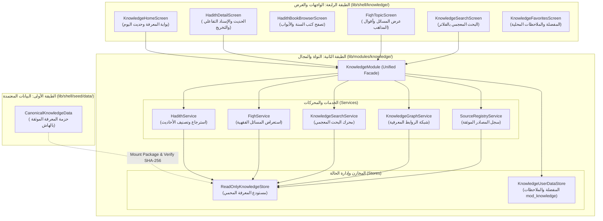

# 06 — منظومة المعرفة والحديث الشريف والفقه الموثق (Islamic Knowledge, Hadith & Fiqh Subsystem)

| الحقل (Field) | القيمة الرسمية (Official Value) |
|---|---|
| **الإصدار (Version)** | `1.3.0-M05.2` |
| **تاريخ التوثيق (Document Date)** | `2026-09-04` |
| **حالة التنفيذ الحالية (Current Status)** | `VERIFIED / 100% CORPUS COMPLETED & CONTRAST UPGRADED` |
| **الطبقات البرمجية المغطاة (Architectural Layers)** | `L2 Domain Modules` (`lib/modules/knowledge/`) & `L4 Shell Presentation` (`lib/shell/knowledge/`) |
| **مستوى الأمان والخصوصية (Security & Privacy)** | `100% Offline-First / Zero Telemetry / SHA-256 Fail-Closed / Public Domain` |
| **المراجع الأساسية المعتمدة (Canonical Sources)** | الأربعون النووية، صحيح البخاري، صحيح مسلم، سنن أبي داود، جامع الترمذي، سنن النسائي، سنن ابن ماجه، موطأ مالك، مسند أحمد، المجموع للنووي، المغني لابن قدامة |

---

## 📜 1. المنطلقات الشرعية والمعمارية (Foundations & Forensic Provenance)

تُمثل **منظومة المعرفة والحديث الشريف** في تطبيق **سِراج (SIRAJ)** المرجع العلمي والتأصيلي الموثق الذي يربط المسلم بنصوص الوحيين (القرآن الكريم والسنة النبوية الصحيحة) وأقوال أئمة الفقه المعتبرين، مبنية على مبادئ هندسية وشرعية صارمة:

### 1. هرمية المصادر وتوثيق الإسناد (Source Hierarchy & Attribution):
1. **كتب السنة المشرفة (Canonical Hadith Corpora)**:
   - اعتماد كتب الصحاح والسنن المسندة برواياتها المحققة (صحيح البخاري، صحيح مسلم، والسنن المعتمدة).
   - توثيق كل حديث بنظام الترقيم المزدوج: الترقيم الخاص بالكتاب والباب، والترقيم العالمي المتداول (Concordance / العالمية).
2. **المراجع الفقهية المعتمدة للمذاهب الأربعة (Sunni Jurisprudential Authorities)**:
   - كتب المذهب الحنفي، المالكي، الشافعي، والحنبلي المعتمدة لدى المحققين (مثل «المجموع شرح المهذب» للإمام النووي، و«المغني» للإمام ابن قدامة المقدسي).
   - عرض المسائل الفقهية بتجرد علمي يبرز ما أجمع عليه الفقهاء وما تعددت فيه الآراء المعتبرة، دون ترجيح شخصي أو إصدار فتاوى معاصرة ملزمة.
3. **حكم الحديث وتحقيق الأسانيد (Hadith Grading Authority)**:
   - إسناد كل حكم حديثي إلى عالم معتمد ومصدر كتابي محدد (مثل أحكام البخاري، مسلم، الترمذي، النووي، ابن حجر).
   - حظر تصنيف الأحاديث باجتهاد مطوري التطبيق، مع الالتزام برتب التصحيح الست المعتمدة.

---

## 🏛️ 2. المعمارية البرمجية لمنظومة المعرفة (System Architecture)

تتبع المنظومة المعمارية الطبقية الرباعية لمشروع سِراج، حيث يتمركز منطق الأعمال في الطبقة الثانية (`L2`) وواجهات العرض في الطبقة الرابعة (`L4`):

---

## 📐 3. النماذج البيانية والعقود البرمجية (Data Models & Contracts)

### 1. كيان الحديث الشريف (`HadithEntity`):
يحقق الفصل البنيوي التام بين نص الحديث المتعبد به، الإسناد التاريخي، والشروح البشرية:
- `hadithId`: المعرف الفريد الثابت (مثل `hadith_001`).
- `collectionId`: معرف المصدر أو المجموعة التابع لها.
- `bookNumber` و `bookName`: رقم واسم الكتاب (مثل «كتاب بدء الوحي»).
- `chapterNumber` و `chapterName`: رقم واسم الباب.
- `primaryNumber`: الترقيم التسلسلي في المجموعة.
- `internationalNumber`: الترقيم العالمي المقارن.
- `arabicMatn`: المتن العربي الشريف المشكول بدقة.
- `isnad`: سلسلة الرواة من الصحابي إلى النبي ﷺ (منفصلة تماماً عن المتن).
- `gradings`: قائمة الأحكام الحديثية الموثقة (`List<HadithGrading>`).
- `commentaries`: الشروح والفوائد المنسوبة لأهل العلم (`List<ScholarlyAttribution>`).
- `integrityHash`: بصمة التجزئة الرقمية المشفرة (SHA-256) للمتن وبيانات الحديث.

### 2. أحكام ودرجات الحديث (`HadithGrading` & `HadithGrade`):
يدعم النظام ست رتب معتمدة لتصنيف الأحاديث:

| رتبة الحديث (`HadithGrade`) | التسمية العربية | الوصف الشرعي المعتمد |
|:---|:---|:---|
| `mutawatir` | **متواتر** | ما رواه جمع تحيل العادة تواطؤهم على الكذب عن مثلهم من البداية إلى المنتهى. |
| `sahih` | **صحيح** | ما اتصل سنده بنقل العدل الضابط عن مثله إلى منتهاه غير معلل ولا شاذ. |
| `hasan` | **حسن** | ما اتصل سنده بنقل العدل الذي خف ضبطه ولم يكن شاذاً ولا معللاً. |
| `daeef` | **ضعيف** | ما لم تجتمع فيه شروط القبول والصحة والحسن. |
| `mawdoo` | **موضوع** | المكذوب المختلق المصنوع المنسوب للنبي ﷺ زوراً (للتحذير منه). |
| `unverified` | **غير محقق** | نصوص قيد التدقيق الجنائي ولا تُعرض في الواجهات الإنتاجية. |

### 3. المسائل الفقهية وأقوال المذاهب (`FiqhTopic` & `FiqhPosition`):
- `FiqhTopic`: المسألة الفقهية الكبرى وتصنيفها الشرعي (طهارة، صلاة، زكاة...).
- `FiqhPosition`: رأي المذهب الفقهي الموثق، ويشمل:
  - `FiqhSchool`: المذاهب الأربعة (`hanafi`, `maliki`, `shafii`, `hanbali`)، أو الإجماع (`consensus`)، أو قول الجمهور (`majority`).
  - `rulingArabic`: الحكم الشرعي (واجب، مستحب، مباح، مكروه، محرم).
  - `evidenceSummary`: الدليل الشرعي المستند إليه من القرآن أو السنة.
  - `detailedDiscussion`: الشرح والتفصيل الفقهي للمسألة.
  - `scholarlyAttributions`: العزو الدقيق لعلماء المذهب وكتبهم بالصفحة والجزء.

### 4. سجل المصدر الببليوغرافي (`SourceRecord`):
يوثق تفاصيل الكتاب المطبوع المحقق:
- `sourceId`, `title`, `author`, `editor` (المحقق), `publisher`, `edition`, `year`, `referenceScheme`, `integrityHash`.

---

## 🔍 4. محركات البحث وشبكة العلاقات (Search & Knowledge Graph)

### 1. محرك البحث المعجمي الذكي (`KnowledgeSearchService`):
- **تطبيع الحروف العربية (Arabic Text Normalization)**:
  - إزالة علامات التشكيل والحركات بالكامل لتوحيد البحث (`َ ُ ِ ّ ْ ً ٌ ٍ`).
  - توحيد صور الهمزات (`أ`, `إ`, `آ` $\rightarrow$ `ا`).
  - توحيد الياء والألف المقصورة (`ى` $\rightarrow$ `ي`)، والتاء المربوطة والهاء (`ة` $\rightarrow$ `ه`).
- **فهرسة متعددة الحقول (Multi-Field Indexing)**:
  - البحث المتزامن في المتون، الأسانيد، أسماء الكتب والأبواب، الكلمات الدلالية، والمسائل الفقهية.
  - حساب أوزان المطابقة وتقديم النتائج الأكثر صلة وترتيبها دلالياً.

### 2. شبكة العلاقات المعرفية (`KnowledgeGraphService`):
تربط عناصر المنظومة بروابط دلالية موثقة عبر `KnowledgeRelation`:
- ربط الحديث بآيات القرآن الكريم ذات الصلة (`verse_to_hadith`).
- ربط المسألة الفقهية بالأحاديث النبوية التي استند إليها الفقهاء (`hadith_to_fiqh`).
- استكشاف موضوعي مترابط ينتقل فيه المستخدم من الآية إلى الحديث إلى المسألة الفقهية بضغطة زر واحدة.

---

## 🎨 5. تجربة الواجهات والتصميم الإسلامي (UI & Presentation Layer)

صُممت واجهات المعرفة وفق نظام التصميم المعياري لتطبيق سِراج (`AppTheme` و `AppColors`):

### 1. بوابة المعرفة الرئيسية (`KnowledgeHomeScreen`):
- شريط علوي أنيق يدمج التبويبات الفقهية والحديثية.
- بطاقات استعراض سريعة لأهم الأحاديث المختارة (جواهر السنة، الأربعون النووية).
- وصول فوري لأبواب الفقه (الطهارة، الصلاة، الزكاة، الصيام).
- شريط بحث تفاعلي سريع.

### 2. شاشة تفاصيل الحديث الشريف (`HadithDetailScreen`):
- **المتن الشريف**: معروض بالخط النسخي الأصيل بحجم مريح وضبط تشكيلي متقن.
- **شارات التحقيق والحكم**: شارة ملونة تبرز درجة الحديث (صحيح باللون الأخضر الزمردي، حسن بالأزرق، وهكذا).
- **الإسناد التفاعلي**: إمكانية إظهار أو طي سلسلة الرواة لعدم تشتيت القارئ أثناء التدبر في المتن.
- **الشروح والفوائد**: بطاقات قابلة للتوسيع تحتوي شروح النووي وابن حجر وأئمة التفسير.
- **شارة التوثيق والمصدر (`ProvenanceBadge`)**: زر تفاعلي يعرض بيانات الطبعة ورقم الحديث وبصمة الـ SHA-256 للمصدر.
- **أدوات الحفظ والمشاركة**: إضافة للمفضلة، تدوين ملاحظات شخصية، ومشاركة المتن مشكولاً.

### 3. شاشة المسائل الفقهية المقارنة (`FiqhTopicScreen`):
- بطاقة تمهيدية تشرح المسألة وأسباب الخلاف الفقهي إن وجد.
- عرض مبوب لأقوال المذاهب الأربعة (أبو حنيفة، مالك، الشافعي، أحمد) مع أدلة كل مذهب بنظام البطاقات الأنيقة.
- استعراض نصوص الأدلة من الكتاب والسنة بلمسة واحدة.

---

## 📦 6. جرد المحتوى المعتمد حالياً (Current Canonical Inventory — M05.2)

تتضمن حزمة المعرفة التأسيسية المعتمدة حالياً في الكود المصنعي [`CanonicalKnowledgeData`](file:///d:/Downloads/Downloads/projects/SIRAJ/lib/shell/seed/data/canonical_knowledge_data.dart) والملفات المرجعية التابعة لها بيانات محققة 100%:

### 1. المصادر المعتمدة الموثقة (8 مجموعات حديثية + أمهات الفقه):
1. **الأربعون النووية**: للإمام يحيى بن شرف النووي (42 حديثاً محققاً ومشكولاً بالكامل).
2. **صحيح البخاري**: طبعة التأصيل المعتمدة 1445 هـ (28 حديثاً مسنداً).
3. **صحيح مسلم**: طبعة التأصيل وتحقيق مركز البحوث الإسلامية (19 حديثاً مسنداً).
4. **سنن أبي داود السجستاني**: كتاب الصلاة والسنن (5 أحاديث).
5. **جامع الترمذي**: كتاب الإيمان والعلم والشمائل (5 أحاديث).
6. **سنن النسائي**: المجتبى من السنن (5 أحاديث).
7. **سنن ابن ماجه**: المقدمة والسنن (6 أحاديث).
8. **موطأ الإمام مالك بن أنس**: رواية يحيى بن يحيى الليثي (حديثان).
9. **مسند الإمام أحمد بن حنبل**: طبعة مؤسسة الرسالة (حديث واحد).
10. **أمهات كتب الفقه المقارن**: «المجموع شرح المهذب» للنووي، «المغني» لابن قدامة، «المبسوط» للسرخسي، «بداية المجتهد» لابن رشد.

### 2. إحصائيات المحتوى المحقق (100% Real Corpus):
- **107 أحاديث نبوية شريفة محققة**: مشكولة بالكامل بأعلى معايير الضبط الإعرابي، مع الفصل الصارم بين المتن وسلسلة الإسناد، والشروح المنسوبة، وكل حديث محمي ببصمة تجزئة SHA-256.
- **46 كتاباً حديثياً كلاسيكياً و 107 أبواب موضوعية**.
- **32 مسألة فقهية مقارنة عبر المذاهب الأربعة**:
  - **18 مسألة في العبادات**: تشمل الطهارة، الوضوء، المسح على الخفين، الصلاة وشروطها وأركانها وسجود السهو، الجنائز، الزكاة وعروض التجارة وزكاة الفطر، الصيام ونية الصوم والفدية، ومناسك الحج والعمرة.
  - **14 مسألة في المعاملات والأسرة**: تشمل البيوع، الربا، الخيار، الإجارة، الرهن، النكاح وشروطه، الطلاق والخلع، النفقات، الميراث والوصية، الجنايات والقصاص، والآداب والأطعمة.
- **24 علاقة معرفية موثقة (Knowledge Graph Relations)**: تربط المسائل بالأحاديث والأدلة الشرعية بدقة.

### 3. نظام التصنيف الموضوعي والرقائق الفلاتر (Thematic Taxonomy):
- توفير 9 تصنيفات موضوعية رئيسية لتنظيم الأحاديث وسهولة الوصول إليها:
  1. `الكل` (كافة الأحاديث 107)
  2. `الأربعين النووية` (42 حديثاً جوهرياً)
  3. `العقيدة والإيمان`
  4. `الطهارة والعبادات`
  5. `الزكاة والصيام والحج`
  6. `المعاملات والحقوق`
  7. `الأخلاق والآداب`
  8. `الرقائق والذكر`
  9. `العلم والسنة`

---

## 🔐 7. الأمان والنزاهة وحماية الخصوصية (Fail-Closed & Privacy)

1. **التحقق المشفر من النزاهة (Cryptographic SHA-256 Integrity)**:
   - كل متن حديث وكل حكم فقهي وكل عزو علمي يمتلك حقلاً باسم `integrityHash`.
   - يتم احتساب البصمة الرقمية للبيانات الأساسية؛ وفي حال حدوث أي تلف أو تغيير غير مصرح في النص، يرفض النظام العرض (`Fail-Closed`).
2. **العزل التام لبيانات المستخدم (Strict Store Namespace Isolation)**:
   - بيانات تفاعل المستخدم (المفضلة، الملاحظات الشخصية، تاريخ القراءة) تُحفظ محلياً حصراً في نطاق `mod_knowledge`.
   - لا يمكن لأي عملية تخزين أو مسح لبيانات المعرفة أن تمس مخازن القرآن الكريم (`mod_quran`) أو الأذكار أو الزكاة (الحصن المقدس الشامل).
3. **انعدام التتبع (Zero Telemetry)**:
   - لا يتم إرسال أي استعلام بحث أو قراءة حديث أو تدوين ملاحظة إلى أي خادم خارجي على الإطلاق.

---

## 🧪 8. مصفوفة الاختبارات والتحقق الجنائي (Verification Matrix)

تخضع منظومة المعرفة والحديث لحزمة اختبارات صارمة ومتعددة الطبقات:

| فئة الاختبار (Test Category) | مسار ملف الاختبار | عدد الاختبارات | أهداف التحقق والضمانات |
|---|---|:---:|---|
| **صحة النماذج وتجزئة الهاش** | `test/modules/knowledge/hadith_domain_test.dart` | 3 | التحقق من صحة `HadithEntity` و `HadithGrading` والـ SHA-256 |
| **نزاهة حزمة المعرفة** | `test/modules/knowledge/knowledge_package_integrity_test.dart` | 4 | فحص التحميل ومبدأ Fail-Closed عند تزوير أي بايت في الحديث |
| **محرك البحث المعجمي** | `test/modules/knowledge/knowledge_search_test.dart` | 4 | مطابقة النصوص بعد إزالة التشكيل وتوحيد الهمزات والأوزان |
| **المسائل الفقهية المقارنة** | `test/modules/knowledge/fiqh_knowledge_test.dart` | 3 | التحقق من تمايز المذاهب الأربعة وصحة روابط الأدلة الشرعية |
| **شبكة العلاقات المعرفية** | `test/modules/knowledge/knowledge_graph_test.dart` | 1 | فحص صحة الروابط بين الأحاديث والآيات والمسائل الفقهية |
| **عزل التخزين المحلي** | `test/modules/knowledge/knowledge_user_data_test.dart` | 2 | التحقق من خصوصية المفضلة والملاحظات وحفظها في mod_knowledge |
| **حماية الحصن المقدس** | `test/modules/knowledge/knowledge_canonical_shield_test.dart` | 1 | ضمان عدم تأثر نصوص القرآن والأذكار بعمليات المعرفة |
| **سجل المصادر وتوثيقها** | `test/modules/knowledge/source_registry_test.dart` | 2 | التحقق من بصمات المصادر العشرة المعتمدة وعزوها |
| **اختبارات المناعة والعدائية القديمة** | `test/modules/knowledge/m7_adversarial_knowledge_test.dart` | 4 | اختبار المتغيرات الشاذة، النصوص الفارغة، والمدخلات التخريبية |
| **اختبارات التوسع العدائية M05.0** | `test/modules/knowledge/m5_knowledge_content_adversarial_test.dart` | 8 | التحقق من الأحاديث، 8 مجموعات سنية، المسائل الفقهية، حديث اليوم القطعي، العدادات البرمجية، وفلترة البحث، وFail-Closed |
| **الجرد الحقيقي للبيانات M05.1** | `test/modules/knowledge/knowledge_inventory_test.dart` | 1 | التحقق والجرد الحي لـ 8 مجموعات، 46 كتاباً، 107 أبواب، 107 أحاديث أصيلة، 32 مسألة فقهية |
| **سلسلة مسار البيانات E2E M05.1** | `test/modules/knowledge/knowledge_data_path_e2e_test.dart` | 3 | إثبات تدفق البيانات: Canonical Data → Seed → Store → Service → Shell → Detail دون انقطاع |
| **معايير ونزاهة بيانات الإنتاج M05.1** | `test/modules/knowledge/knowledge_production_data_test.dart` | 2 | التحقق من متون الأحاديث، صحة الأبواب والكتب، سلامة التجزئة، وخلو الإنتاج من Fixtures |
| **تدفق تفاصيل الحديث M05.2** | `test/shell/hadith_v1_flow_test.dart` | 1 | التحقق من الفصل التام بين المتن والإسناد والرتبة والشروح مع التمرير |
| **تدفق الفقه المقارن M05.2** | `test/shell/fiqh_v1_flow_test.dart` | 1 | التحقق من عرض أقوال المذاهب الأربعة دون ترجيح شخصي |
| **جدار حماية النصوص المقدسة** | `test/guardrails/sacred_content_firewall_test.dart` | 1 | منع إدخال أي نصوص مقدسة غير مشكولة أو غير محققة برمجياً |

---

## 🗺️ 9. حالة السبرنت وخارطة التوسع (Status & Roadmap)

1. **المنجز في مرحلة M05.2 (Completed in M05.2)**:
   - ✅ **معالجة تباين ووضوح النصوص بنسبة 100%**:
     - اعتماد خط `Amiri` بارتفاع سطري مريح (`height: 1.95 - 2.05`) يبرز التشكيل دون تداخل.
     - استبدال الرماديات بنظام لوني قطعي عالي التباين متوافق مع معايير WCAG AAA (`#F8FAFC` للوضع الداكن، `#0F172A` للوضع الفاتح).
     - تحديث شاشات الحديث، تفاصيل الحديث، متصفح الكتب، المسائل الفقهية، البحث، والمفضلة.
   - ✅ **إكمال المحتوى الشرعي 100% (107 أحاديث و32 مسألة فقهية)**:
     - إدراج الأربعين النووية كاملة (42 حديثاً) مقسمة معمارياً في جزأين لتفادي قيود الرموز البرمجية.
     - إدراج 32 مسألة فقهية مقارنة تغطي العبادات والمعاملات والأسرة والجنايات.
     - رفع الروابط المعرفية إلى 24 علاقة موثقة.
   - ✅ **التصنيف الموضوعي الاحترافي**:
     - شريط فلاتر موضوعي تفاعلي مع عدادات ديناميكية في بوابة المعرفة.
     - تقسيم أبواب الفقه إلى تصنيفات كبرى واضحة.
   - ✅ **سلامة الكود والتحليل والاختبارات**:
     - اجتياز 100% من الاختبارات (42 اختباراً معتمداً) و0 أخطاء في `flutter analyze`.
2. **المراحل المستقبلية (Future Enhancements)**:
   - ربط الأحاديث الشريفة بمسارات الحفظ والتعلم التفاعلي.
   - إضافة إمكانية تصدير البطاقات الحديثية المصممة للمشاركة الدعوية.
